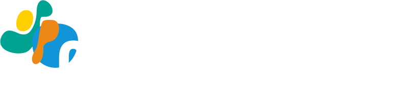

```{=html}
<style>
@font-face {
  font-family: "Atkinson Hyperlegible";
  font-weight: 400;
  src: url("fonts/atkinson-hyperlegible-latin-400-normal.woff2") format("woff2");
}
@font-face {
  font-family: "Atkinson Hyperlegible";
  font-weight: 700;
  src: url("fonts/atkinson-hyperlegible-latin-700-normal.woff2") format("woff2");
}

*, *::before, *::after { box-sizing: border-box; margin: 0; padding: 0; }

:root {
  --navy:  #1f335e;
  --blue:  #003cb3;
  --orange: #ff9100;
  --muted: #f0f4fa;
  --border: #c6d2e8;
  --text:  #222832;
  --small: #555;
}

@page { size: letter; margin: 0.4in 0.5in; }

body {
  font-family: "Atkinson Hyperlegible", Arial, sans-serif;
  font-size: 9pt;
  line-height: 1.4;
  color: var(--text);
  background: #fff;
  max-width: 7.5in;
  margin: 0 auto;
  padding: 0.25in 0;
}

.handout-header {
  display: flex;
  align-items: center;
  gap: 0.9em;
  padding-bottom: 0.45em;
  border-bottom: 3px solid var(--orange);
  margin-bottom: 0.6em;
}

.handout-header img { height: 36px; width: auto; flex-shrink: 0; }

.handout-header-text h1 {
  font-size: 13pt;
  font-weight: 700;
  color: var(--navy);
  line-height: 1.2;
  margin: 0;
}

.handout-header-text p {
  font-size: 8pt;
  color: var(--small);
  margin-top: 0.1em;
}

.handout-body {
  display: grid;
  grid-template-columns: 55% 1fr;
  gap: 1.2em;
}

.section-label {
  font-size: 7.5pt;
  font-weight: 700;
  letter-spacing: 0.09em;
  text-transform: uppercase;
  color: var(--navy);
  border-bottom: 2px solid var(--navy);
  padding-bottom: 0.18em;
  margin-bottom: 0.45em;
}

/* ── Timeline ── */

.timeline {
  position: relative;
  display: block;
}

/* Vertical connecting line */
.timeline::before {
  content: '';
  position: absolute;
  left: 2.8em;
  top: 0;
  bottom: 0;
  width: 1.5px;
  background: var(--border);
  z-index: 0;
}

.era-label {
  display: block;
  font-size: 6pt;
  font-weight: 700;
  text-transform: uppercase;
  letter-spacing: 0.1em;
  color: var(--orange);
  padding: 0.42em 0 0.16em 3.5em;
  position: relative;
  z-index: 1;
}

.era-label:first-child {
  padding-top: 0;
}

.tl-entry {
  display: grid;
  grid-template-columns: 2.1em 0.9em 1fr;
  gap: 0 0.25em;
  align-items: start;
  margin-bottom: 0.33em;
  position: relative;
  z-index: 1;
}

.tl-year {
  font-size: 6pt;
  font-weight: 700;
  color: #999;
  text-align: right;
  padding-top: 0.15em;
  line-height: 1.2;
}

.tl-dot-col {
  display: flex;
  justify-content: center;
  padding-top: 0.22em;
}

.tl-dot {
  width: 7px;
  height: 7px;
  border-radius: 50%;
  background: var(--orange);
  border: 1.5px solid #fff;
  flex-shrink: 0;
}

.tl-body { min-width: 0; }

.tl-name-row {
  display: flex;
  align-items: baseline;
  gap: 0.4em;
  flex-wrap: wrap;
  margin-bottom: 0.04em;
}

.tl-name {
  font-weight: 700;
  color: var(--navy);
  font-size: 8.5pt;
}

.tl-origin {
  font-size: 6.5pt;
  color: var(--small);
}

.tl-desc {
  font-size: 8pt;
  line-height: 1.36;
}

.tl-link {
  font-size: 7pt;
  color: var(--blue);
  text-decoration: none;
  margin-left: 0.3em;
  white-space: nowrap;
}

.tl-link:hover { color: var(--orange); }

/* ── Also list ── */

.also-list {
  display: flex;
  flex-wrap: wrap;
  gap: 0.28em;
  margin-top: 0.38em;
}

.also-badge {
  background: var(--muted);
  border: 1px solid var(--border);
  border-radius: 3px;
  padding: 0.12em 0.4em;
  font-size: 7.5pt;
  color: var(--navy);
  font-weight: 600;
  white-space: nowrap;
}

/* ── Right column ── */

.right-col { display: flex; flex-direction: column; gap: 0.6em; }

.panel { border: 1px solid var(--border); border-radius: 5px; overflow: hidden; }

.panel-head {
  background: var(--navy);
  color: #fff;
  font-size: 7.5pt;
  font-weight: 700;
  letter-spacing: 0.07em;
  text-transform: uppercase;
  padding: 0.28em 0.55em;
}

.panel-body { padding: 0.45em 0.55em; background: #fff; }

.panel-body p, .panel-body li { font-size: 8.5pt; line-height: 1.38; }

.stat-row { display: flex; align-items: baseline; gap: 0.35em; margin-bottom: 0.25em; }

.stat-num { font-size: 15pt; font-weight: 700; color: var(--orange); line-height: 1; }

.stat-label { font-size: 8pt; color: var(--text); line-height: 1.3; }

.stat-divider { border: none; border-top: 1px solid var(--border); margin: 0.3em 0; }

.campus-chips { display: flex; flex-wrap: wrap; gap: 0.22em; margin-top: 0.22em; }

.campus-chip {
  background: var(--orange);
  color: #fff;
  border-radius: 3px;
  padding: 0.1em 0.38em;
  font-size: 7pt;
  font-weight: 700;
}

.area-row { display: flex; gap: 0.3em; margin-bottom: 0.18em; }
.area-icon { color: var(--orange); flex-shrink: 0; }
.area-text { font-size: 8.5pt; }
.area-text strong { color: var(--navy); }

.resource-row { display: flex; align-items: center; gap: 0.38em; margin-bottom: 0.18em; font-size: 8.5pt; }

.resource-file {
  font-family: "SFMono-Regular", Consolas, monospace;
  font-size: 7.5pt;
  background: var(--muted);
  color: var(--navy);
  border-radius: 2px;
  padding: 0.08em 0.28em;
  white-space: nowrap;
}

.learn-link { display: block; font-size: 8.5pt; font-weight: 700; color: var(--blue); text-decoration: none; margin-bottom: 0.18em; }
.learn-link:hover { color: var(--orange); }

.handout-footer {
  margin-top: 0.55em;
  padding-top: 0.35em;
  border-top: 1px solid var(--border);
  font-size: 7pt;
  color: var(--small);
  display: flex;
  justify-content: space-between;
}

@media print {
  body { max-width: 100%; padding: 0; }
  a { color: var(--blue) !important; }
  .learn-link { color: var(--blue) !important; }
}
</style>

<div class="handout-header">
  
  <div class="handout-header-text">
    <h1>UC Open Source as Institutional Infrastructure</h1>
    <p>Tim Dennis &middot; Data Science Center, UCLA Library &middot; IASSIST 2026 &middot; Slides: <strong>tinyurl.com/iassist2026</strong> &middot; Handout: <strong>tinyurl.com/iassist2026-handout</strong></p>
  </div>
</div>

<div class="handout-body">

<div class="left-col">

<div class="section-label">From Dissertation to Global Infrastructure</div>

<div class="timeline">

  <div class="era-label">Open Source Foundation</div>

  <div class="tl-entry">
    <div class="tl-year">1977</div>
    <div class="tl-dot-col"><div class="tl-dot"></div></div>
    <div class="tl-body">
      <div class="tl-name-row">
        <span class="tl-name">BSD Unix</span>
        <span class="tl-origin">UC Berkeley</span>
      </div>
      <div class="tl-desc">Permissive licensing that made open source possible. MIT, Apache, and BSD licenses now govern billions of lines of production software. <a class="tl-link" href="https://www.mckusick.com/history/index.html">history &rarr;</a></div>
    </div>
  </div>

  <div class="tl-entry">
    <div class="tl-year">1973</div>
    <div class="tl-dot-col"><div class="tl-dot"></div></div>
    <div class="tl-body">
      <div class="tl-name-row">
        <span class="tl-name">INGRES / PostgreSQL</span>
        <span class="tl-origin">UC Berkeley</span>
      </div>
      <div class="tl-desc">Stonebraker and Wong repurposed a geography grant to build INGRES after reading Codd's relational model papers, releasing it freely. The open code seeded Sybase and, indirectly, Microsoft SQL Server. Stonebraker's follow-on POSTGRES (1986) pioneered object-relational databases; open-source volunteers forked it in 1995 to create <strong>PostgreSQL</strong>, the world's most popular independent open-source database. <a class="tl-link" href="https://www.postgresql.org">postgresql.org &rarr;</a></div>
    </div>
  </div>

  <div class="era-label">Universal Infrastructure</div>

  <div class="tl-entry">
    <div class="tl-year">1986</div>
    <div class="tl-dot-col"><div class="tl-dot"></div></div>
    <div class="tl-body">
      <div class="tl-name-row">
        <span class="tl-name">tz database</span>
        <span class="tl-origin">UCLA (Paul Eggert, since 2005)</span>
      </div>
      <div class="tl-desc">Every OS clock on the planet depends on this. Eggert used 19th-century almanacs to reconstruct pre-1883 timezone history. A 2011 IP lawsuit nearly took it offline; IANA now has stewardship. <a class="tl-link" href="https://www.iana.org/time-zones">iana.org/time-zones &rarr;</a></div>
    </div>
  </div>

  <div class="era-label">Open Science</div>

  <div class="tl-entry">
    <div class="tl-year">2000</div>
    <div class="tl-dot-col"><div class="tl-dot"></div></div>
    <div class="tl-body">
      <div class="tl-name-row">
        <span class="tl-name">UCSC Genome Browser</span>
        <span class="tl-origin">UC Santa Cruz</span>
      </div>
      <div class="tl-desc">Jim Kent assembled the human genome on 50 borrowed PCs, finishing three days before Celera Genomics and its supercomputer. The genome stayed in the public domain. <a class="tl-link" href="https://genome.ucsc.edu">genome.ucsc.edu &rarr;</a></div>
    </div>
  </div>

  <div class="era-label">Scientific Computing &amp; Domain Science</div>

  <div class="tl-entry">
    <div class="tl-year">2001</div>
    <div class="tl-dot-col"><div class="tl-dot"></div></div>
    <div class="tl-body">
      <div class="tl-name-row">
        <span class="tl-name">Jupyter</span>
        <span class="tl-origin">UC Berkeley</span>
      </div>
      <div class="tl-desc">Fernando P&eacute;rez built the first IPython in an afternoon procrastinating on his physics dissertation. Carol Willing, a core Steering Council member and Python Core Developer, shared the 2017 ACM Software System Award for Jupyter's global influence. P&eacute;rez is now faculty director of BIDS and co-PI on the UC OSPO Network. <a class="tl-link" href="https://jupyter.org">jupyter.org &rarr;</a></div>
    </div>
  </div>

  <div class="tl-entry">
    <div class="tl-year">2001</div>
    <div class="tl-dot-col"><div class="tl-dot"></div></div>
    <div class="tl-body">
      <div class="tl-name-row">
        <span class="tl-name">EEGLAB</span>
        <span class="tl-origin">UC San Diego</span>
      </div>
      <div class="tl-desc">The world's premier open-source environment for electrophysiological signal processing. Over <strong>350,000 downloads</strong>; the 2004 foundational paper has <strong>14,400+ citations</strong>, among the highest academic footprints of any scientific software. <a class="tl-link" href="https://sccn.ucsd.edu/eeglab/">eeglab &rarr;</a></div>
    </div>
  </div>

  <div class="tl-entry">
    <div class="tl-year">2003</div>
    <div class="tl-dot-col"><div class="tl-dot"></div></div>
    <div class="tl-body">
      <div class="tl-name-row">
        <span class="tl-name">Cytoscape</span>
        <span class="tl-origin">UC San Diego</span>
      </div>
      <div class="tl-desc">The global standard for network biology: visualizing disease pathways, protein interactions, and molecular networks. Over <strong>300,000 downloads per year</strong>; foundational to cancer and therapeutic research worldwide. <a class="tl-link" href="https://cytoscape.org">cytoscape.org &rarr;</a></div>
    </div>
  </div>

  <div class="era-label">Infrastructure at Scale</div>

  <div class="tl-entry">
    <div class="tl-year">2004</div>
    <div class="tl-dot-col"><div class="tl-dot"></div></div>
    <div class="tl-body">
      <div class="tl-name-row">
        <span class="tl-name">Ceph</span>
        <span class="tl-origin">UC Santa Cruz</span>
      </div>
      <div class="tl-desc">Sage Weil&rsquo;s PhD dissertation on exabyte-scale distributed storage. Merged into the Linux kernel (2010); commercialization proceeds funded <strong>CROSS at UCSC</strong>, the first UC OSPO and seed of this network. <a class="tl-link" href="https://ceph.io">ceph.io &rarr;</a></div>
    </div>
  </div>

  <div class="tl-entry">
    <div class="tl-year">2009</div>
    <div class="tl-dot-col"><div class="tl-dot"></div></div>
    <div class="tl-body">
      <div class="tl-name-row">
        <span class="tl-name">Apache Spark</span>
        <span class="tl-origin">UC Berkeley AMPLab</span>
      </div>
      <div class="tl-desc">Matei Zaharia built it so a classmate could beat the Netflix Prize with faster distributed ML. Holden Karau (PMC member, core committer) scaled its Python and core engines. Donated to Apache before commercializing; Databricks now valued at <strong>$62B+</strong>. <a class="tl-link" href="https://spark.apache.org">spark.apache.org &rarr;</a></div>
    </div>
  </div>

  <div class="tl-entry">
    <div class="tl-year">2010</div>
    <div class="tl-dot-col"><div class="tl-dot"></div></div>
    <div class="tl-body">
      <div class="tl-name-row">
        <span class="tl-name">RISC-V</span>
        <span class="tl-origin">UC Berkeley</span>
      </div>
      <div class="tl-desc">A three-month summer project to avoid paying ARM royalties. Now in <strong>10 billion devices</strong>, 350+ member organizations in 70 countries. Foundation relocated to Switzerland in 2020 to stay neutral in US-China trade tensions. <a class="tl-link" href="https://riscv.org">riscv.org &rarr;</a></div>
    </div>
  </div>

  <div class="tl-entry">
    <div class="tl-year">2010</div>
    <div class="tl-dot-col"><div class="tl-dot"></div></div>
    <div class="tl-body">
      <div class="tl-name-row">
        <span class="tl-name">Named Data Networking</span>
        <span class="tl-origin">UCLA &middot; Lixia Zhang, Lead PI</span>
      </div>
      <div class="tl-desc">Zhang drove tractors in rural China during the Cultural Revolution, earned her PhD at MIT, and was the only woman at the first IETF meeting (1986). She coined "middlebox," designed RSVP, and is in the Internet Hall of Fame. NDN rethinks internet architecture at the protocol level. <a class="tl-link" href="https://named-data.net">named-data.net &rarr;</a></div>
    </div>
  </div>

  <div class="era-label">AI Infrastructure</div>

  <div class="tl-entry">
    <div class="tl-year">2016</div>
    <div class="tl-dot-col"><div class="tl-dot"></div></div>
    <div class="tl-body">
      <div class="tl-name-row">
        <span class="tl-name">Ray</span>
        <span class="tl-origin">UC Berkeley RISELab</span>
      </div>
      <div class="tl-desc">Two PhD students tired of rewriting Python to scale. Now <strong>core OpenAI compute infrastructure</strong>. Donated to the Linux Foundation in 2025. <a class="tl-link" href="https://ray.io">ray.io &rarr;</a></div>
    </div>
  </div>

</div>

<div style="margin-top:0.42em;">
  <div class="section-label" style="font-size:7pt;">Also from UC campuses</div>
  <div class="also-list">
    <span class="also-badge">Apache HTTP Server (Brian Behlendorf, UCB)</span>
    <span class="also-badge">Processing (UCLA)</span>
    <span class="also-badge">UCSD Pascal</span>
    <span class="also-badge">ChimeraX (UCSF)</span>
    <span class="also-badge">OpenMM (UCSF)</span>
    <span class="also-badge">sourmash (UC Davis)</span>
    <span class="also-badge">ERPLAB (UC Davis)</span>
  </div>
</div>

</div>

<div class="right-col">

  <div class="panel">
    <div class="panel-head">The UC OSPO Network</div>
    <div class="panel-body">
      <div class="stat-row">
        <div class="stat-num">6</div>
        <div class="stat-label">UC campuses &middot; launched April 2024<br>Alfred P. Sloan Foundation</div>
      </div>
      <div class="stat-row">
        <div class="stat-num">$1.85M</div>
        <div class="stat-label">in external funding to date</div>
      </div>
      <div class="stat-row">
        <div class="stat-num">280K+</div>
        <div class="stat-label">students &middot; 25,000+ faculty served</div>
      </div>
      <hr class="stat-divider">
      <div class="campus-chips">
        <span class="campus-chip">Santa Cruz</span>
        <span class="campus-chip">Berkeley</span>
        <span class="campus-chip">Davis</span>
        <span class="campus-chip">Los Angeles</span>
        <span class="campus-chip">Santa Barbara</span>
        <span class="campus-chip">San Diego</span>
      </div>
      <p style="font-size:7.5pt; color:#777; margin-top:0.3em;">Lead: UCSC, first OSPO in a large state university system. Part of <strong>CURIOSS</strong> (34 academic OSPOs worldwide).</p>
    </div>
  </div>

  <div class="panel">
    <div class="panel-head">What We Found (2025 survey, n=294)</div>
    <div class="panel-body">
      <div class="stat-row">
        <div class="stat-num">52K</div>
        <div class="stat-label">institutionally affiliated repos across 10 UC campuses</div>
      </div>
      <hr class="stat-divider">
      <div class="stat-row">
        <div class="stat-num">58%</div>
        <div class="stat-label">of UC OSS contributors are also <em>maintainers</em>, not just users but stewards</div>
      </div>
      <hr class="stat-divider">
      <p style="font-size:8.5pt; margin-bottom:0.18em;"><strong>#1 challenge:</strong> time to write documentation</p>
      <p style="font-size:8.5pt;"><strong>Nationally (Tidelift 2024):</strong> 60% unpaid &middot; 43% burnt out</p>
    </div>
  </div>

  <div class="panel">
    <div class="panel-head">Why It Matters: The Economics</div>
    <div class="panel-body">
      <div class="stat-row">
        <div class="stat-num">$8.8T</div>
        <div class="stat-label">demand-side replacement value of open source software to global enterprises</div>
      </div>
      <p style="font-size:7.5pt; color:#777; margin-top:0.2em;">Supply-side cost to recreate the top 5,000 packages: $4.15B. If OSS disappeared and every organization built its own: $8.8 trillion. Ratio: ~2,000x. Hoffmann, Nagle &amp; Zhou (2024) HBS WP 24-038.</p>
    </div>
  </div>

  <div class="panel">
    <div class="panel-head">Three Focus Areas</div>
    <div class="panel-body">
      <div class="area-row">
        <div class="area-icon">&#128301;</div>
        <div class="area-text"><strong>Discovery:</strong> UC Open Repository Browser (UC ORB); GitHub pipeline + system-wide survey</div>
      </div>
      <div class="area-row">
        <div class="area-icon">&#127807;</div>
        <div class="area-text"><strong>Sustainability:</strong> Cross-campus licensing WG; OSSPREY project health assessment; community management</div>
      </div>
      <div class="area-row">
        <div class="area-icon">&#128214;</div>
        <div class="area-text"><strong>Education:</strong> Curriculum inventory at ucospo.net/education; Carpentries + CodeRefinery + UC content</div>
      </div>
    </div>
  </div>

  <div class="panel">
    <div class="panel-head">Resources for Your Researchers</div>
    <div class="panel-body">
      <div class="resource-row"><span class="resource-file">README.md</span> template + guide &middot; <a href="https://ucospo.net/oss-resources/template-guides/readme-guide/" style="font-size:7.5pt; color:var(--blue);">link</a></div>
      <div class="resource-row"><span class="resource-file">LICENSE</span> guide with UC-approved options &middot; <a href="https://ucospo.net/oss-resources/template-guides/license-guide/" style="font-size:7.5pt; color:var(--blue);">link</a></div>
      <div class="resource-row"><span class="resource-file">CONTRIBUTING.md</span> template + guide &middot; <a href="https://ucospo.net/oss-resources/template-guides/contributing-guide/" style="font-size:7.5pt; color:var(--blue);">link</a></div>
      <div class="resource-row"><span class="resource-file">CODE_OF_CONDUCT.md</span> Contributor Covenant &middot; <a href="https://ucospo.net/oss-resources/template-guides/code-of-conduct-guide/" style="font-size:7.5pt; color:var(--blue);">link</a></div>
      <div class="resource-row"><span class="resource-file">CITATION.cff</span> + Zenodo &rarr; citable DOI</div>
      <p style="font-size:7.5pt; color:#777; margin-top:0.25em;">All at <strong>ucospo.net/oss-resources</strong> &middot; Sept 2025</p>
    </div>
  </div>

  <div class="panel">
    <div class="panel-head">Learn More</div>
    <div class="panel-body">
      <a class="learn-link" href="https://ucospo.net">ucospo.net</a>
      <a class="learn-link" href="https://ucospo.net/education">ucospo.net/education</a>
      <a class="learn-link" href="https://curioss.org">curioss.org, 34 academic OSPOs worldwide</a>
      <hr class="stat-divider" style="margin:0.25em 0;">
      <p style="font-size:8.5pt;"><strong>Tim Dennis</strong><br>Data Science Center, UCLA Library<br><a href="mailto:tdennis@library.ucla.edu" style="color:var(--blue);">tdennis@library.ucla.edu</a></p>
    </div>
  </div>

</div>

</div>

<div class="handout-footer">
  <span>Gomez et al. (2025) arxiv:2506.18359 &middot; Scarlett et al. (2025) doi:10.31235/osf.io/p8bx6_v1 &middot; Tidelift (2024) State of the Open Source Maintainer Report &middot; Ruff (2026) youtu.be/eBriL3CDNeo</span>
  <span>IASSIST 2026</span>
</div>
```
