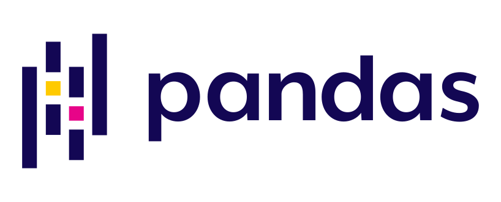
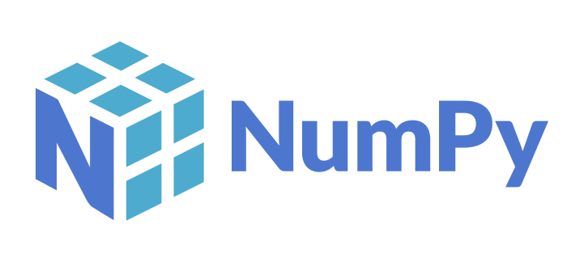
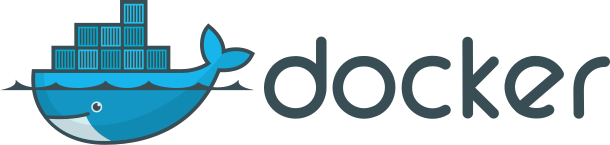

## The invisible layer

:::: {.columns}

::: {.column width="56%"}
Research data workflows run on open source:

* Data collection, cleaning, analysis, visualization
* Reproducibility tooling: containers, workflows, version control
* Repositories and scholarly infrastructure

**92%** of researchers use software; **69%** say their research would not be practical without it.

The people keeping it running are increasingly called **Research Software Engineers (RSEs)**, a growing professional community with no standard institutional home.

If every organization had to replace open source with proprietary equivalents, the cost would exceed **$8.8 trillion**.

::: {.small}
Hettrick et al. (<abbr title="Software Sustainability Institute">SSI</abbr>, 2014/2022) · Hoffmann, Nagle & Zhou (2024) doi:10.2139/ssrn.4693148
:::
:::

::: {.column width="44%"}
<div style="display:flex; flex-direction:column; align-items:center; gap:0.8em; padding-top:0.3em;">
<div class="logo-row" style="gap:1.1em; flex-wrap:wrap; justify-content:center;">
<div class="logo-item logo-item-sm"><span>Jupyter</span></div>
<div class="logo-item logo-item-sm"><span>Python</span></div>
<div class="logo-item logo-item-sm"><span>R</span></div>
<div class="logo-item logo-item-sm"><span>Git</span></div>
<div class="logo-item logo-item-sm"><span>Spark</span></div>
<div class="logo-item logo-item-sm"><span>Pandas</span></div>
<div class="logo-item logo-item-sm"><span>NumPy</span></div>
<div class="logo-item logo-item-sm"><span>Docker</span></div>
<div class="logo-item logo-item-sm"><span>Ray</span></div>
<div class="logo-item logo-item-sm"><span>ggplot2</span></div>
<div class="logo-item logo-item-sm"><span>dplyr</span></div>
<div class="logo-item logo-item-sm"><span>Snakemake</span></div>
<div class="logo-item logo-item-sm"><span>Nextflow</span></div>
</div>
</div>
:::

::::

::: {.notes}
- Open: "You work with this software every day — Jupyter, R, Python, Git"
- 67% said "impossible" — let that land before moving on
- RSE: a growing profession with no institutional home; that's the gap this talk is about
- $8.8T: use with administrators; this is not a niche concern
:::

---

## The UC research-to-infrastructure pipeline

:::: {.columns}

::: {.column width="52%"}
Data professionals built open data infrastructure: <abbr title="Findable, Accessible, Interoperable, Reusable">FAIR</abbr>, <abbr title="Data Management Plans">DMPs</abbr>, curation, provenance.

**<abbr title="FAIR Principles for Research Software">FAIR4RS</abbr>** is the same inflection point for software — and UC has been showing the way for 50 years.

BSD Unix · Ceph · Apache Spark · Jupyter · <abbr title="Reduced Instruction Set Computer - V">RISC-V</abbr> · Ray

The pipeline from university research to global infrastructure is not rare or accidental.

::: {.small}
Barker et al. (2022) doi:10.1038/s41597-022-01710-x
:::
:::

::: {.column width="48%"}
<div class="uc-oss-grid" role="list" aria-label="Open source projects by UC campus" style="zoom:0.82;">

<div class="campus-block" role="listitem">
<span class="campus-label">UC Berkeley</span>
<div class="logo-row">
<div class="logo-item"><span>Jupyter</span></div>
<div class="logo-item"><span>Apache Spark</span></div>
<div class="logo-item"><span>RISC-V</span></div>
<div class="logo-item"><span>Ray</span></div>
<div class="logo-item logo-item-sm"><span>BSD Unix</span></div>
</div>
</div>

<div class="campus-block" role="listitem">
<span class="campus-label">UC Santa Cruz</span>
<div class="logo-row">
<div class="logo-item logo-item-sm"><span>Ceph</span></div>
<span class="project-badge">UCSC Genome Browser</span>
</div>
</div>

<div class="campus-block" role="listitem">
<span class="campus-label">UC San Diego</span>
<div class="logo-row">
<span class="project-badge">Cytoscape</span>
<span class="project-badge">EEGLAB</span>
<div class="logo-item logo-item-sm"><span>UCSD Pascal</span></div>
</div>
</div>

<div class="campus-block" role="listitem">
<span class="campus-label">UCLA</span>
<div class="logo-row">
<div class="logo-item logo-item-sm"><span>Processing</span></div>
<div class="logo-item logo-item-sm"><span>Named Data Networking</span></div>
<span class="project-badge">tz database</span>
</div>
</div>

<div class="campus-block" role="listitem">
<span class="campus-label">UC San Francisco</span>
<div class="logo-row">
<span class="project-badge">ChimeraX</span>
<div class="logo-item logo-item-sm"><span>OpenMM</span></div>
</div>
</div>

<div class="campus-block" role="listitem">
<span class="campus-label">UC Davis</span>
<div class="logo-row">
<div class="logo-item logo-item-sm"><span>sourmash</span></div>
<span class="project-badge">ERPLAB</span>
</div>
</div>

</div>
:::

::::

::: {.notes}
- Bridge: "You helped make data a first-class output — software is the next frontier"
- FAIR4RS (2022) = cite if challenged; same community, same logic
- Berkeley row: audience-recognizable; Jupyter = procrastinating PhD student; Spark = Netflix Prize; Ray = now core OpenAI compute
- Optional if time: "A 2000 UCSC grad student assembled the human genome on 50 borrowed PCs, three days ahead of a corporate supercomputer. Genome stayed public."
- Transition: "That track record is why a network model made sense."
:::

---

## What is an academic OSPO?

:::: {.columns}

::: {.column width="44%"}
An **Open Source Program Office** supports, governs, and promotes open source within an institution.

* Originated in industry: ~77% of large tech companies have one
* First academic OSPO: Johns Hopkins, 2019
* **34 academic OSPOs** in <abbr title="Community for University and Research Institution OSPOs">CURIOSS</abbr> worldwide and growing
* Core functions: policy, licensing guidance, best practices, education, community
:::

::: {.column width="56%"}

```{ojs}
//| echo: false
//| output: false
world_topo = fetch("https://cdn.jsdelivr.net/npm/world-atlas@2/countries-110m.json").then(r => r.json())
members = FileAttachment("curioss-members.csv").csv({typed: true})
```

```{ojs}
//| echo: false
Plot.plot({
  projection: {
    type: "equal-earth",
    domain: {
      type: "MultiPoint",
      coordinates: members.map(d => [+d.lon, +d.lat])
    },
    inset: 40
  },
  width: 660,
  height: 340,
  style: {background: "transparent"},
  marks: [
    Plot.graticule({stroke: "#e8eef8", strokeWidth: 0.5}),
    Plot.geo(topojson.feature(world_topo, world_topo.objects.land), {
      fill: "#e8eef8", stroke: "#ccc", strokeWidth: 0.5
    }),
    Plot.dot(members, {
      x: d => +d.lon,
      y: d => +d.lat,
      r: 7,
      fill: d => d.uc_network === "yes" ? "#ff9100" : "#003cb3",
      stroke: "white",
      strokeWidth: 1.2,
      tip: true,
      title: d => d.name
    })
  ]
})
```

[🟠 UC OSPO Network &nbsp;·&nbsp; 🔵 CURIOSS member]{.small}

::: {.sr-only}
World map showing 34 CURIOSS member institutions. Six UC campuses (orange) in California: Santa Cruz, Berkeley, Davis, Los Angeles, Santa Barbara, and San Diego. Twenty-eight additional institutions (blue) across the US, UK, Switzerland, Spain, Ireland, Luxembourg, and France.
:::

:::

::::

::: {.notes}
- Map is live — hover for institution names; UC = orange cluster on the west coast
- Academic model: less compliance than industry, more enabling researchers who are already doing OSS without support
- 34 and growing fast: was ~20 at CNI late 2024
- Transition: "UC didn't start one OSPO — it built a network of six."
:::

---

## The UC OSPO Network

:::: {.columns}

::: {.column width="48%"}
A **multi-campus collaboration** treating open source as shared infrastructure.

* 6 campuses: Santa Cruz, Berkeley, Davis, Los Angeles, Santa Barbara, San Diego
* Launched April 2024, funded by the Alfred P. Sloan Foundation
* **$1.85M** in external funding to date
* Lead: UC Santa Cruz, the first OSPO in a large state university system
* Serves 280,000+ students and 25,000+ faculty

Acts as a **neutral convener**: no single campus, company, or grant cycle can pull the work away.

::: {.small}
Ruff (2026) UC Open Summit · youtu.be/eBriL3CDNeo
:::
:::

::: {.column width="52%"}

```{ojs}
//| echo: false
//| output: false
ca_states = fetch("https://cdn.jsdelivr.net/npm/us-atlas@3/states-10m.json").then(r => r.json())
uc_network_campuses = [
  {name: "UC Santa Cruz", short: "UCSC", lon: -122.0583, lat: 36.9741},
  {name: "UC Berkeley", short: "UCB", lon: -122.2595, lat: 37.8724},
  {name: "UC Davis", short: "UCD", lon: -121.7619, lat: 38.5382},
  {name: "UC Los Angeles", short: "UCLA", lon: -118.4452, lat: 34.0689},
  {name: "UC Santa Barbara", short: "UCSB", lon: -119.8489, lat: 34.4140},
  {name: "UC San Diego", short: "UCSD", lon: -117.2340, lat: 32.8801}
]
```

```{ojs}
//| echo: false
Plot.plot({
  projection: {
    type: "mercator",
    domain: {type: "MultiPoint", coordinates: [[-124.5, 32.4], [-114, 42.1]]}
  },
  width: 500,
  height: 420,
  style: {background: "transparent"},
  marks: [
    Plot.geo(
      topojson.feature(ca_states, ca_states.objects.states).features.find(d => +d.id === 6),
      {fill: "#e8eef8", stroke: "#b0bbcc", strokeWidth: 0.8}
    ),
    Plot.dot(uc_network_campuses, {
      x: d => d.lon,
      y: d => d.lat,
      r: 10,
      fill: "#ff9100",
      stroke: "white",
      strokeWidth: 1.8,
      tip: true,
      title: d => d.name
    }),
    Plot.text(uc_network_campuses, {
      x: d => d.lon,
      y: d => d.lat,
      text: d => d.short,
      dy: -18,
      fontSize: 13,
      fontWeight: "bold",
      fill: "#1f335e",
      stroke: "white",
      strokeWidth: 3
    })
  ]
})
```

::: {.sr-only}
Map of California showing six UC OSPO Network campuses: Santa Cruz, Berkeley, Davis, Los Angeles, Santa Barbara, and San Diego.
:::

:::

::::

::: {.notes}
- UCSC led: Ceph dissertation → CROSS → first UC OSPO 2022 → Sloan funded the network
- Neutral convener (Ruff): "code in neutral trust — no single company can pull on it"; UC does this at system scale for policy and governance
- $1.85M from Sloan; working on extension and UCOP pathway for permanent funding
:::

---

## Discovery · Sustainability · Education

::: {style="font-size:0.82em;"}
:::: {.columns}

::: {.column width="33%"}
::: {style="background:#f0f4fa; border-radius:8px; padding:1.2em 1em;"}
[🔭]{style="font-size:2.2em;"}

**Discovery**

Mapping who does what across the UC system

* 236,000+ repos scanned; ~82,000 institutionally affiliated
* 294-respondent system-wide survey
* UC Open Repository Browser (UC ORB)
:::
:::

::: {.column width="33%"}
::: {style="background:#f0f4fa; border-radius:8px; padding:1.2em 1em;"}
[🌱]{style="font-size:2.2em;"}

**Sustainability**

Keeping projects and communities healthy

* **58%** of UC contributors are also maintainers
* Cross-campus licensing working group (<abbr title="UC Office of the President">UCOP</abbr> + tech transfer)
* Project health assessment (<abbr title="Open Source PRoject sustainabilitY tracker">OSSPREY</abbr>)
:::
:::

::: {.column width="33%"}
::: {style="background:#f0f4fa; border-radius:8px; padding:1.2em 1em;"}
[📖]{style="font-size:2.2em;"}

**Education**

Coordinated training across campuses

* Gap analysis → curriculum inventory → learning pathways
* Published at [ucospo.net/education](https://ucospo.net/education)
* Coordinated with Carpentries infrastructure

:::
:::

::::
:::

::: {.small}
Gomez et al. (2025) arxiv:2506.18359 · Scarlett et al. (2025) doi:10.31235/osf.io/p8bx6_v1
:::

::: {.notes}
- Discovery: inventory, assess, make visible — work this audience knows; Juanita Gomez built UC ORB
- Sustainability: 58% = not downloaders, stewards; nationally 60% unpaid, nearly two-thirds have quit or considered quitting (Tidelift 2024)
- Licensing WG = clearest "only a network can do this" example: that table doesn't exist without a system-level convener
- Education: treat training like data — find gaps, don't duplicate; living curriculum inventory, not a course catalog
:::

---

## Lessons from two years

What the network model enables that single campuses cannot:

1. **Shared staffing**: community manager, licensing specialist, technical roles
2. **Policy leverage**: the network has standing with UCOP; individual campuses do not
3. **Data at scale**: the GitHub and survey analyses require system-wide scope to mean anything
4. **Equity**: smaller campuses get services they could not build alone
5. **A replicable model**: $1.85M produced something other state systems can follow

Each campus contributes unique expertise; the network routes it to where it's needed.

::: {.notes}
- Point 2 is the strongest argument for network over standalone OSPO
- Point 4: a librarian at a smaller campus now draws on six campuses' expertise
- Open challenge: moving from grant funding to permanent infrastructure
- This pattern — distributed nodes, shared governance, thematic working groups — transfers to any large university system
:::

---

## Where this meets your work

For data professionals, the OSPO sits at the intersection of:

* Research software engineering ↔ data management
* Licensing compliance ↔ open data policy
* Reproducibility tooling ↔ FAIR / FAIR4RS
* Training infrastructure ↔ data literacy programs
* RSE community ↔ library research support

**For your institution:**

* Where does open source software governance currently live?
* What would it take to treat it as infrastructure rather than a side project?

::: {.notes}
- IASSIST members should be at the OSPO table — you work across the research lifecycle, understand data governance, run training
- Ask the room: "Does your institution have an RSE group, research computing team, or data science center? That's where this conversation starts."
- RSEs are often already adjacent to library services; this is a natural collaboration
:::

---

## You're already doing this work

:::: {.columns}

::: {.column width="52%"}
If you do technical data services, researchers are already bringing you these questions:

* "What license should I use for this code?"
* "Is this library still maintained? Should I depend on it?"
* "How do I make this reproducible and citable?"
* "My funder wants a software management plan."
* "How do I accept contributions from collaborators?"

**That is OSPO work.** The frame makes it legible to your institution.

**The network has already built the resources** (Laura Langdon, UC OSPO):

::: {.small}
[`README`](https://ucospo.net/oss-resources/template-guides/readme-guide/) · [`LICENSE`](https://ucospo.net/oss-resources/template-guides/license-guide/) · [`CONTRIBUTING`](https://ucospo.net/oss-resources/template-guides/contributing-guide/) · [`CODE_OF_CONDUCT`](https://ucospo.net/oss-resources/template-guides/code-of-conduct-guide/) · `CITATION.cff` + Zenodo <abbr title="Digital Object Identifier">DOI</abbr> · [Growing a Community](https://ucospo.net/oss-resources/growing-community/) · [Carpentries Incubator lesson](https://ucospo.net/research-software-citable-discoverable/)
:::
:::

::: {.column width="48%"}

::: {style="background:#1f335e; border-radius:8px; padding:0.85em 0.9em; color:white; margin-bottom:0.5em;"}
**Raise the floor, not just solve the ticket**

Fixing their immediate problem gets them through the week.

Moving them from "it runs on my machine" to maintainable, licensed, citable software gets their whole lab there, and their students after them.

You don't need a formal OSPO to do this. You need the frame.
:::

::: {style="background:#f0f4fa; border-radius:8px; padding:0.65em 0.9em; font-size:0.72em;"}
**OSPO heuristics already in your toolkit:**
health signals · bus factor · governance files · FAIR4RS · software <abbr title="Data Management Plans">DMPs</abbr> · contributor conventions · community governance
:::

:::

::::

::: {.notes}
- Ask for hands: "How many have heard one of these questions in the last year?"
- Key reframe: reactive (fixes the week) vs. capacity-building (shifts lab practice for students and future grants)
- Resources live on ucospo.net now; use them in consultations today — no institutional approval needed
- Close: "You don't need to build an OSPO. Use the frame. Use the resources."
:::

---

## Learn more / connect

:::: {.columns}

::: {.column width="68%"}
**UC OSPO Network:** [ucospo.net](https://ucospo.net)

* Education site: [ucospo.net/education](https://ucospo.net/education)
* Mailing list, Slack, events calendar

**Global network:** [curioss.org](https://curioss.org), 34 academic OSPOs worldwide and growing

**Tim Dennis**
Data Science Center, UCLA Library
[{style="vertical-align:middle; margin-right:0.3em;"}](https://orcid.org/0000-0001-6632-3812)[orcid.org/0000-0001-6632-3812](https://orcid.org/0000-0001-6632-3812)
tdennis@library.ucla.edu

::: {.small style="margin-top:0.7em; padding:0.5em 0.8em; background:#f0f4fa; border-radius:6px; border-left:3px solid #ff9100;"}
🖥 Slides: **tinyurl.com/iassist2026**

📄 Handout: **tinyurl.com/iassist2026-handout**
:::
:::

::: {.column width="32%"}
<div style="display:flex; flex-direction:column; align-items:center; justify-content:center; gap:0.5em; height:100%">
{width="200px"}

::: {.small style="text-align:center; color:#555;"}
tinyurl.com/iassist2026
:::
</div>
:::

::::

::: {.notes}
- Leave 2-3 min for questions; sustainability and "you're already doing this" slides tend to generate them
- UC ORB: good follow-up for anyone who wants to see the discovery tooling
- CURIOSS: good for anyone whose institution is considering starting an OSPO
:::

---

## References

::: {#refs style="font-size:0.62em; line-height:1.8;"}
:::
