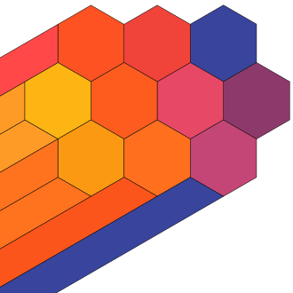
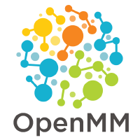
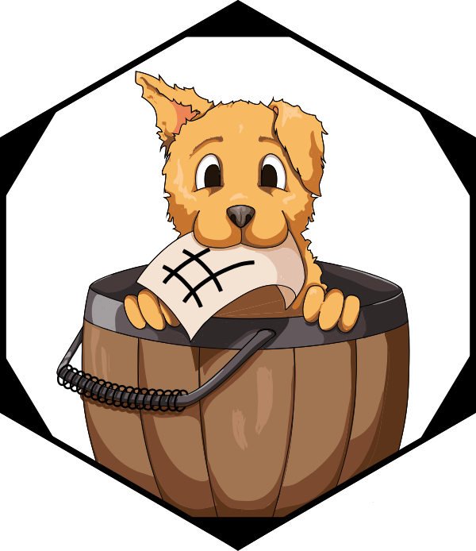

## The invisible layer

Research data workflows run on open source:

* Data collection, cleaning, analysis, visualization
* Reproducibility tooling: containers, workflows, version control
* Repositories and scholarly infrastructure

**92%** of researchers use software; **67%** say their research would be impossible without it.

The people keeping it running are increasingly called **Research Software Engineers (RSEs)** - a growing professional community with no standard institutional home.

::: {.small}
Hettrick et al. (SSI, 2014/2022)
:::

::: {.notes}
IMAGE: a grid of OSS tool logos researchers actually use — Jupyter, Python, R, Git, Pandas, numpy, ggplot2. Makes the "invisible layer" concrete before you say a word.

Start with what this room knows. 92% of researchers depend on software; two-thirds say their work would stop without it. The people doing this work are increasingly organizing under the RSE identity — US-RSE launched in 2018 and now has thousands of members. When a maintainer burns out, a key library gets abandoned. A licensing question blocks a publication. There is often nowhere to turn. That is the gap.
:::

---

## We've been here before

People in this room helped build the open data movement:

* FAIR principles: from aspiration to institutional expectation
* Data management plans embedded in grant workflows
* Curation, provenance, and stewardship as professional services
* Open science infrastructure: repositories, PIDs, metadata standards
* **FAIR4RS**: FAIR principles now extended to research software

**Software is the next frontier** — and UC has been showing the way for 50 years: BSD Unix, Ceph, Apache Spark, RISC-V, Ray. The pipeline from university research to global infrastructure is not rare or accidental.

> "The research done in academia was the seed. Foundations provided the soil. But the community was the sun."

::: {.small}
Barker et al. (2022) doi:10.1038/s41597-022-01710-x · Ruff, N. (2026) "The Role of Foundations in Advancing Open Collaboration and Innovation," UC Open Summit. youtu.be/eBriL3CDNeo
:::

::: {.notes}
IMAGE: the FAIR principles diagram or a simple timeline of open data milestones works here if you want a visual anchor.

FAIR did not happen by accident. It happened because data professionals insisted that data deserved first-class treatment as a scholarly output. FAIR4RS (Barker et al. 2022, RDA/FORCE11/ReSA working group) applies the same Findable, Accessible, Interoperable, Reusable framework to software. We are at that same inflection point.

The UC pipeline is the concrete proof:

BSD Unix — Berkeley, 1970s–80s. The licensing model that made open source possible.

Ceph — UCSC Storage Systems Research Center, started 2004. Sage Weil's doctoral dissertation under Prof. Scott A. Brandt, designed from the ground up for exabyte-scale distributed storage on commodity hardware. The Ceph client was merged into the Linux kernel by 2010. Weil founded Inktank to commercialize it; Red Hat acquired Inktank in 2014. The Linux Foundation launched the Ceph Foundation in 2018 to give it neutral governance independent of any single vendor. Critically: the proceeds from that commercialization funded CROSS at UCSC, which became the first UC OSPO and the seed of this network.

Apache Spark — Berkeley AMPLab, 2009. Donated to Apache before commercializing; Databricks followed. Now valued at $60B+.

RISC-V — Berkeley, 2010. A three-month teaching tool that became a global open CPU standard with 350+ org members in 70 countries, shipping in billions of devices.

Ray — Berkeley RISELab, 2016 class project. Donated to Linux Foundation in 2025. Now core infrastructure for the OpenAI compute stack.

Ruff's point: "The students writing their class projects this very semester may be creating the next Ray." That is not a metaphor. It is a track record.
:::

---

## The UC research-to-infrastructure pipeline

<div class="uc-oss-grid" role="list" aria-label="Open source projects by UC campus">

<div class="campus-block" role="listitem">
<span class="campus-label">UC Berkeley</span>
<div class="logo-row">
<div class="logo-item"><span>Jupyter</span></div>
<div class="logo-item"><span>Apache Spark</span></div>
<div class="logo-item"><span>RISC-V</span></div>
<div class="logo-item"><span>Ray</span></div>
<div class="logo-item logo-item-sm"><span>BSD Unix</span></div>
</div>
</div>

<div class="campus-block" role="listitem">
<span class="campus-label">UC Santa Cruz</span>
<div class="logo-row">
<div class="logo-item logo-item-sm"><span>Ceph</span></div>
<span class="project-badge">UCSC Genome Browser</span>
</div>
</div>

<div class="campus-block" role="listitem">
<span class="campus-label">UC San Diego</span>
<div class="logo-row">
<span class="project-badge">Cytoscape</span>
<span class="project-badge">EEGLAB</span>
<div class="logo-item logo-item-sm"><span>UCSD Pascal</span></div>
</div>
</div>

<div class="campus-block" role="listitem">
<span class="campus-label">UCLA</span>
<div class="logo-row">
<div class="logo-item logo-item-sm"><span>Processing</span></div>
<div class="logo-item logo-item-sm"><span>Named Data Networking</span></div>
<span class="project-badge">tz database</span>
</div>
</div>

<div class="campus-block" role="listitem">
<span class="campus-label">UC San Francisco</span>
<div class="logo-row">
<span class="project-badge">ChimeraX</span>
<div class="logo-item logo-item-sm"><span>OpenMM</span></div>
</div>
</div>

<div class="campus-block" role="listitem">
<span class="campus-label">UC Davis</span>
<div class="logo-row">
<div class="logo-item logo-item-sm"><span>sourmash</span></div>
<span class="project-badge">ERPLAB</span>
</div>
</div>

</div>

::: {.notes}
Berkeley gets the headline logos because those are audience-recognizable. But point to the whole grid: systems infrastructure (Berkeley, UCSC), bioinformatics and neuroscience pipelines (UCSD, UCSF, Davis), and internet infrastructure (UCLA). The pattern holds everywhere.

Origin stories for each, if you need them:

**Jupyter** — Pérez was a physics PhD at CU Boulder, built the first IPython in an afternoon procrastinating on his thesis. "The interactive tool running millions of AI workflows was born from one grad student avoiding his dissertation."

**Spark** — Matei Zaharia, Berkeley AMPLab, 2009. His classmate Lester Mackey needed faster distributed ML to compete in the $1M Netflix Prize. Spark was the fix. Databricks now $60B+.

**RISC-V** — Krste Asanović and David Patterson, 2010. A three-month summer project to give grad students a chip architecture to experiment on without paying ARM royalties. Now in 10 billion devices. Foundation moved to Switzerland in 2020 to stay neutral in the US-China trade war.

**Ray** — Nishihara and Moritz, RISELab, 2016. Two PhD students tired of rewriting Python every time they wanted to scale to more than one machine. Now core OpenAI compute infrastructure.

**Ceph** — Sage Weil's dissertation, UCSC SSRC, 2004. Designed to store data at exabyte scale without a central lookup table. Weil founded Inktank; Red Hat acquired it in 2014. Those proceeds funded CROSS at UCSC — which became the first UC OSPO, and the seed of this network.

**UCSC Genome Browser** — Jim Kent, UCSC PhD student, summer 2000. He assembled the human genome on 50 borrowed PCs while icing his wrists to prevent carpal tunnel, finishing three days before Celera Genomics and its supercomputer. The genome stayed in the public domain. (See next slide.)

**Cytoscape** — Trey Ideker, UCSD, 2003. High-throughput biology was producing molecular interaction tables no spreadsheet could handle. He built visual "living maps" of the cell. Now the de facto standard for network biology.

**EEGLAB** — Scott Makeig, Salk Institute → UCSD, 1997–2001. Funded by the inventor of laser barcoding, who wanted to decode the brain's own scanning systems.

**Processing** — Casey Reas (UCLA Design Media Arts) and Ben Fry co-created Processing in 2001 at MIT Media Lab. Designed to teach programming through visual art — a sketchbook for code. Now the Processing Foundation; used in art, design, and data visualization education worldwide.

**tz database** — Paul Eggert, UCLA, volunteer since 2005. To reconstruct pre-1883 timezone history, he used almanacs compiled by 19th-century astrologers who recorded precise local solar times to cast horoscopes. Every OS clock on the planet depends on this.

**ChimeraX** — UCSF RBVI, successor to Chimera. Built for cryo-EM data too large for older renderers. Lets structural biologists explode 3D virus structures on screen to find drug-binding pockets.

**sourmash** — Titus Brown + Luiz Irber, UC Davis, 2016. Sequence databases were growing faster than BLAST could search them. FracMinHash sketching compresses genomes into fingerprints; a laptop can now search billions of sequences in seconds.
:::

---

## {background-color="#1f335e"}

::: {style="text-align: center; color: #ffffff; line-height: 1.8; margin-top: 0.8em;"}

**Summer 2000. UC Santa Cruz.**

PhD student Jim Kent assembled the human genome
on 50 borrowed PCs, icing his wrists to keep coding.

He finished **three days** before a corporate competitor's supercomputer.

**The genome stayed in the public domain.**

:::

::: {style="text-align: center; color: rgba(255,255,255,0.6); font-size: 0.52em; margin-top: 1.8em;"}
Kent, J.W. (2002). BLAT — The BLAST-Like Alignment Tool. *Genome Research* 12, 656–664. · genome.ucsc.edu
:::

::: {.notes}
Take a beat here. Let the room absorb it.

The competitor was Celera Genomics — $300M in private funding, dedicated supercomputer cluster. Kent was working with 50 off-the-shelf PCs assembled in a hallway. He reportedly wrote GigAssembler (~10,000 lines of C) in a few intense weeks while finishing his dissertation. The "pajamas and wrist ice" detail comes from contemporaneous accounts.

This is the open data movement, applied to biology, won by a grad student. It is exactly the argument this room already makes about data — that scientific outputs belong in the commons — applied to software. If your audience has any doubt about why this work matters, this story is the answer.

After the beat: "That is what UC research infrastructure looks like at the start."
:::

---

## What is an academic OSPO?

:::: {.columns}

::: {.column width="44%"}
An **Open Source Program Office** supports, governs, and promotes open source within an institution.

* Originated in industry: ~77% of large tech companies have one
* First academic OSPO: Johns Hopkins, 2019
* **34 academic OSPOs** in CURIOSS worldwide and growing
* Core functions: policy, licensing guidance, best practices, education, community
:::

::: {.column width="56%"}

```{ojs}
//| echo: false
//| output: false
world_topo = fetch("https://cdn.jsdelivr.net/npm/world-atlas@2/countries-110m.json").then(r => r.json())
members = FileAttachment("curioss-members.csv").csv({typed: true})
```

```{ojs}
//| echo: false
Plot.plot({
  projection: {
    type: "equal-earth",
    domain: {
      type: "MultiPoint",
      coordinates: members.map(d => [+d.lon, +d.lat])
    },
    inset: 40
  },
  width: 660,
  height: 340,
  style: {background: "transparent"},
  marks: [
    Plot.graticule({stroke: "#e8eef8", strokeWidth: 0.5}),
    Plot.geo(topojson.feature(world_topo, world_topo.objects.land), {
      fill: "#e8eef8", stroke: "#ccc", strokeWidth: 0.5
    }),
    Plot.dot(members, {
      x: d => +d.lon,
      y: d => +d.lat,
      r: 7,
      fill: d => d.uc_network === "yes" ? "#ff9100" : "#003cb3",
      stroke: "white",
      strokeWidth: 1.2,
      tip: true,
      title: d => d.name
    })
  ]
})
```

[🟠 UC OSPO Network &nbsp;·&nbsp; 🔵 CURIOSS member]{.small}

::: {.sr-only}
World map showing 34 CURIOSS member institutions. Six UC campuses (orange) in California: Santa Cruz, Berkeley, Davis, Los Angeles, Santa Barbara, and San Diego. Twenty-eight additional institutions (blue) across the US, UK, Switzerland, Spain, Ireland, Luxembourg, and France.
:::

:::

::::

::: {.notes}
Map is live and interactive — hover over dots for institution names. UC campuses are the orange cluster on the west coast. The CNI slides from late 2024 showed ~20 members; we're at 34 now. Growing fast.

The academic model is different from industry. Less about compliance, more about enabling researchers and students who are already doing open source work without any support structure.
:::

---

## The UC OSPO Network

A **multi-campus collaboration** treating open source as shared infrastructure.

* 6 campuses: Santa Cruz, Berkeley, Davis, Los Angeles, Santa Barbara, San Diego
* Launched April 2024, funded by the Alfred P. Sloan Foundation
* **$1.85M** in external funding to date
* Lead: UC Santa Cruz, the first OSPO in a large state university system
* Serves 280,000+ students and 25,000+ faculty

Acts as a **neutral convener**: no single campus, company, or grant cycle can pull the work away.

::: {.small}
Ruff (2026) UC Open Summit · youtu.be/eBriL3CDNeo
:::

::: {.notes}
IMAGE: a UC campus map with the six member campuses highlighted lands better than a bullet list here.

UCSC had the head start. Sage Weil developed Ceph as his 2004 dissertation at UCSC's Storage Systems Research Center under Prof. Scott A. Brandt. He founded Inktank to commercialize it; Red Hat acquired Inktank in 2014. Those proceeds funded the Center for Research in Open Source Software (CROSS) at UCSC, which became the first UC OSPO in 2022. Sloan then funded the network model to test what a statewide system could do that single campuses could not.

The neutral convener framing comes directly from Nithya Ruff on why foundations work (UC Open 2026, 8:17–8:49): "when Berkeley students donate code to the Apache Software Foundation or the Linux Foundation, the code is actually held in a neutral trust place. No single company can pull on it. No single country can claim it." The UC OSPO Network does this at system scale for policy, tooling, and governance — not code per se, but the institutional scaffolding around it.
:::

---

## Three thematic areas

:::: {.columns}

::: {.column width="33%"}
::: {style="background:#f0f4fa; border-radius:8px; padding:1.4em 1em; text-align:center; height:400px;"}
[🔭]{style="font-size:3em;"}

**Discovery**

Mapping who does what across the UC system — repos, contributors, tools, and practices
:::
:::

::: {.column width="33%"}
::: {style="background:#f0f4fa; border-radius:8px; padding:1.4em 1em; text-align:center; height:400px;"}
[🌱]{style="font-size:3em;"}

**Sustainability**

Keeping projects and communities healthy through licensing, project health, and community support
:::
:::

::: {.column width="33%"}
::: {style="background:#f0f4fa; border-radius:8px; padding:1.4em 1em; text-align:center; height:400px;"}
[📖]{style="font-size:3em;"}

**Education**

Coordinated training and learning pathways across campuses
:::
:::

::::

::: {.notes}
All network activity falls under these three. Governance maps to them: OSPO Leadership Group plus one working group per theme.
:::

---

## Discovery: knowing what's there

**The 4 Ps framework**, applied at system scale:

* **People**: who contributes to OS software at UC?
* **Product**: what has been built?
* **Practice**: how do faculty and staff engage?
* **Perception**: what are contributors' experiences?

Tools: GitHub pipeline (200,000+ repos scanned; ~52,000 institutionally affiliated across 10 campuses), network-wide survey (294 respondents), UC Open Repository Browser (UC ORB)

::: {.small}
Gomez et al. (2025) arxiv:2506.18359 · Scarlett et al. (2025) doi:10.31235/osf.io/p8bx6_v1
:::

::: {.notes}
IMAGE: a screenshot of the UC ORB (ucospo.net) filtered by campus is a strong visual here. Shows the tooling is real and usable.

This is a methods story your audience will recognize. We are doing what data librarians do: inventory, assess, make visible. Juanita Gomez led the GitHub analysis and built the UC ORB — she gave a full talk on it at FOSSY titled "Recipe for Discovery: Building the UC Open Source Repository Browser From Scratch." The 200,000+ figure is the full pipeline scan; 52,000 are the repos with strong institutional affiliation after filtering. The survey preprint has data going to Dryad.
:::

---

## Sustainability: keeping it running

:::: {.columns}

::: {.column width="58%"}

**58% of UC open source contributors are also maintainers.** Not users: stewards.

What they asked for most: sustainability grants, computing infrastructure, learning communities.

\#1 challenge: **finding time to write documentation.**

Nationally: **60%** of maintainers are unpaid; **43%** report burnout.

Network services:

* Cross-campus licensing working group (UCOP + tech transfer + IT)
* Project health assessment (OSSPREY)
* Containerization support · Community management

::: {.small}
Scarlett et al. (2025) doi:10.31235/osf.io/p8bx6_v1 · Tidelift (2024) State of the Open Source Maintainer Report
:::

:::

::: {.column width="42%"}

<!-- IMAGE: a photo of a lone developer at a laptop, or the UC ORB health dashboard screenshot. The XKCD comic is on the next slide — save it. -->

:::

::::

::: {.notes}
The 58% maintainer stat is the key reframe for this audience. These are not people who downloaded a package. They are sustaining infrastructure other researchers depend on, mostly without institutional recognition. The licensing working group is the clearest example of what only the network can do: it brings together UCOP, tech transfer offices from UCLA, UCB, and UCSC, and IT. That table does not exist without a network-level convener.
:::

---

## The dependency problem

{.r-stretch}

::: {.small}
xkcd #2347 (CC BY-NC 2.5) · UC survey: 58% of contributors are maintainers · Tidelift (2024): 60% unpaid, 43% burnt out
:::

::: {.notes}
Let the comic breathe. The joke lands on its own. The caption connects it to the survey data. "A project some random person in Nebraska has been thanklessly maintaining since 2003" — that person exists at every UC campus, and in most of your institutions too.
:::

---

## AI and open source: a new pressure

AI code generation is changing what it means to maintain a project.

:::: {.columns}

::: {.column width="60%"}

* **Slop PRs**: AI-generated contributions that look complete but are off-spec, shallow, or carry subtle bugs
* Review burden grows while maintainer capacity stays flat
* The OSS projects that trained the models are now flooded by their output
* Security risk: AI-generated code in dependencies with undetected vulnerabilities

**OSPOs are developing responses:** contribution disclosure policies, AI-aware code review norms, project-level guidance.

::: {.small}
Baltes, Cheong & Treude (2026) arxiv:2603.27249 · GitClear (2024) "Coding on Copilot"
:::

:::

::: {.column width="40%"}

::: {style="background:#1f335e; border-radius:8px; padding:1.2em 1em; color:white; text-align:center; margin-top:0.5em;"}
**The structural shift**

**70%** of new AI PhDs go straight to industry

(a decade ago: 50/50)

**90%** of notable AI models come from a handful of companies

Academia is being sidelined from the systems it helped create.

::: {.small style="color:#aac4e8;"}
Ruff (2026) UC Open Summit · youtu.be/eBriL3CDNeo
:::
:::

:::

::::

::: {.notes}
Both stats are from Nithya Ruff's keynote at UC Open 2026 (direct quotes, 6:15–7:15): "70% of new AI PhDs are going to industry. Not a detour, but straight to industry. And it's a historic shift... 90%, 90% of notable AI models are coming from industry... from a small group of industry folks."

Landmark paper to cite: Baltes, Cheong & Treude (2026), "An Endless Stream of AI Slop": The Growing Burden of AI-Assisted Software Development, arXiv:2603.27249. They frame it as a tragedy of the commons — individual productivity gains create externalized costs for maintainers. The curl project shut down its bug bounty program entirely in early 2026 because AI-generated vulnerability reports flooded maintainers, turning a 15-minute verification into days of wasted labor. Godot and RubyGems reported 10x spikes in low-quality AI contributions. The same researchers using AI for data analysis are submitting AI-generated code upstream to the tools they depend on.

GitClear (2024) "Coding on Copilot" documents the code quality angle: AI-assisted development is measurably increasing code churn and reducing code reuse, meaning more review work on lower-quality patches.

Ruff on governance urgency: "The governance layer for AI is being determined, is being written. Policies and governance is being built in 18 to 36 months. And if you're not in the room, I think we will inherit a system that we have to live with."
:::

---

## Education: training as infrastructure

Gap analysis → curriculum inventory → learning pathways

* Inventoried existing materials: Carpentries, CodeRefinery, The Turing Way, UC-specific content
* Organized by topic (licensing, sustainability, community) and by role (contributor, maintainer, manager)
* Published at [ucospo.net/education](https://ucospo.net/education)
* Coordinated with data literacy programs and Carpentries infrastructure

::: {.notes}
IMAGE: a screenshot of the ucospo.net/education site showing the curriculum inventory is a natural fit here.

This is where the work most directly touches IASSIST members' world. The education working group treats training the way data professionals think about data: find what exists, identify gaps, do not duplicate. The site is a living curriculum inventory, not a course catalog.
:::

---

## Governance: intra vs. inter campus

Not everything should be shared. Some things only work at scale.

| Intra-campus | Inter-campus |
|---|---|
| Initial pilots | Platform and tool development |
| Local relationship-building | Licensing and best practices |
| Faster, context-specific support | System-wide discovery |
| Unique institutional context | Field-specific community building |

Network governance: OSPO Leadership Group + working groups; GitHub-based project management.

::: {.notes}
This is the hardest ongoing judgment call. The default: if it requires cross-campus authority or economies of scale, it goes to the network. If it requires local relationships or campus-specific knowledge, it stays on campus.
:::

---

## Lessons from two years

What the network model enables that single campuses cannot:

1. **Shared staffing**: community manager, licensing specialist, technical roles
2. **Policy leverage**: the network has standing with UCOP; individual campuses do not
3. **Data at scale**: the GitHub and survey analyses require system-wide scope to mean anything
4. **Equity**: smaller campuses get services they could not build alone
5. **A replicable model**: $1.85M produced something other state systems can follow

::: {.notes}
Two years in, the model works. The open question is moving from grant funding to permanent infrastructure. Working on a Sloan extension and exploring UCOP pathways. The pattern — distributed nodes, shared governance, thematic working groups — is transferable to any large university system.
:::

---

## Where this meets your work

For data professionals, the OSPO sits at the intersection of:

* Research software engineering ↔ data management
* Licensing compliance ↔ open data policy
* Reproducibility tooling ↔ FAIR / FAIR4RS
* Training infrastructure ↔ data literacy programs
* RSE community ↔ library research support

**For your institution:**

* Where does open source software governance currently live?
* What would it take to treat it as infrastructure rather than a side project?

::: {.notes}
This is the invitation. IASSIST members are exactly the people who should be at the OSPO table. You work across the research lifecycle, you understand data governance, you run training programs. RSEs are natural collaborators — many are already embedded in or adjacent to library services. The question is whether your institution has made the connection yet. If you have an RSE group, a research computing team, or a data science center, the OSPO conversation belongs there too.
:::

---

## What you can do right now

If you advise on data-intensive research, you are probably already helping with code.

**The network has already built the resources:**

* [`README.md`](https://ucospo.net/oss-resources/template-guides/readme-guide/) — template + guide (Laura Langdon, UC OSPO)
* [`LICENSE`](https://ucospo.net/oss-resources/template-guides/license-guide/) — guide includes UC-approved options
* [`CONTRIBUTING.md`](https://ucospo.net/oss-resources/template-guides/contributing-guide/) — template + guide
* [`CODE_OF_CONDUCT.md`](https://ucospo.net/oss-resources/template-guides/code-of-conduct-guide/) — Contributor Covenant + guidance
* `CITATION.cff` + Zenodo release → citable, versioned DOI

**Going further:**

* [Growing a Community Around a Project](https://ucospo.net/oss-resources/growing-community/) — UC OSPO
* [Sharing Research Software: Reproducible, Citable, and Discoverable](https://www.tim-dennis.com/research-software-citable-discoverable/aio.html) — Carpentries Incubator lesson (covers `pixi`, CITATION.cff, Zenodo, discoverability)

::: {.notes}
You do not have to build these resources yourself. Laura Langdon published templates and guides for all four key files in September 2025 — they are on ucospo.net right now. The Carpentries lesson is mine, pre-alpha but usable — it covers the full workflow from licensing through environment management to minting a DOI on Zenodo. A researcher who already deposits data with your help is one conversation away from a fully citable software package. You need the consultation habit and a link to these resources. That is it.
:::

---

## Learn more / connect

**UC OSPO Network:** [ucospo.net](https://ucospo.net)

* Education site: [ucospo.net/education](https://ucospo.net/education)
* Mailing list, Slack, events calendar

**Global network:** [curioss.org](https://curioss.org) — 34 academic OSPOs worldwide and growing

**Tim Dennis**
Data Science Center, UCLA Library
dennis.tim@gmail.com

::: {.notes}
Two things worth following up: UC ORB if they want to see the discovery tooling, and the CURIOSS community if their institution is thinking about starting an OSPO. Leave time for questions — the AI and sustainability slides tend to generate them.
:::
