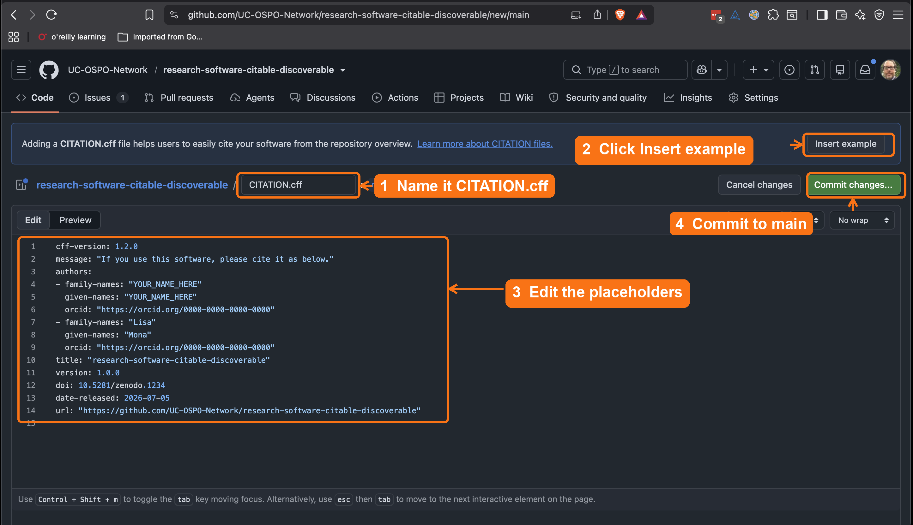
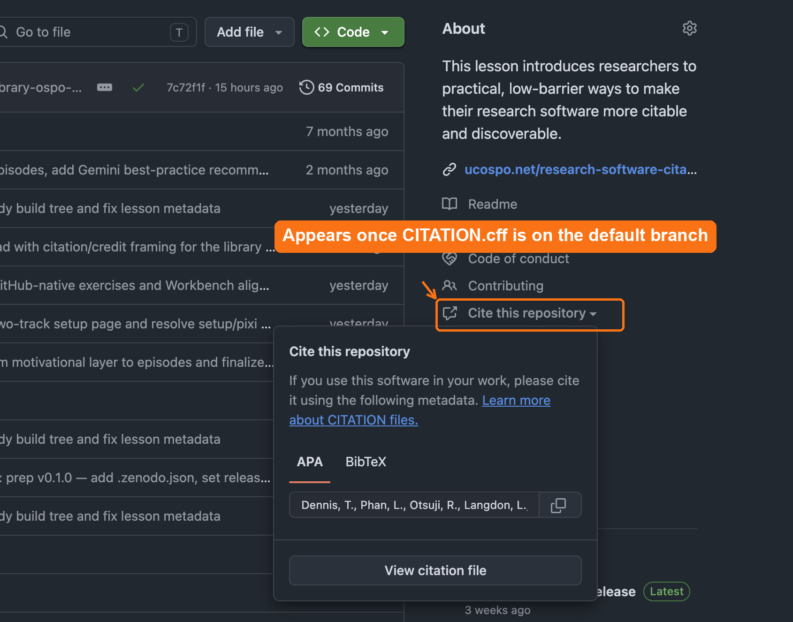

## A catalog record for your software

Nobody emails a book's author to ask how to cite it. The catalog record answers that.

Software has never had one, so people improvise: they cite a URL, or the paper the code appeared in, or nothing.

A `CITATION.cff` file is **the catalog record for a repository**: who to credit and how. Once it exists, GitHub adds a "Cite this repository" button.

::: {.notes}
**BACKUP DECK:** use this only if Laura has to leave before her episode. Otherwise
she presents from her own materials.

**PRE-FLIGHT** Open these tabs, in this order:

1. Your fork of software-demo, at the state after Karla's license episode
   (LICENSE in the root, no CITATION.cff yet)
2. Upstream 03-add-citation: github.com/UC-OSPO-Network/software-demo/tree/03-add-citation
3. cffinit: citation-file-format.github.io/cffinit/

**~2 min · SHOW:** slides only.

**SAY:** Every librarian has shown a student the Cite button on a database record
and watched the relief. This is the same button, on code, and the researcher controls
what it says. It's the highest-return step in the lesson: one small file, committed
once, and every future citation is correct and countable.
:::

## What goes in a CITATION.cff?

:::: {.columns}

::: {.column width="50%"}
**Minimal file, today**

- `title`
- `authors` (ORCID if you have one)
- `message`
- `version` (optional for now)
:::

::: {.column width="50%"}
**As the project grows**

- release versions
- a DOI from Zenodo
- keywords and an abstract
- repository URLs
:::

::::

It works **before** any release or DOI. Update it when you have them.

::: {.small}
If you've edited a repository record or a Dublin Core field, you've done harder metadata work than this. Zenodo and Zotero both read the file, and it travels with every clone and fork.
:::

::: {.notes}
**~2 min · SHOW:** slides only.

**SAY:** Nobody needs the whole schema. The format is YAML and new to most
researchers, but the thinking is native to library work. Start small, publish
useful metadata early, refine it later.
:::

## Create the file on GitHub

In your fork of `software-demo`:

1. **Add file → Create new file**
2. Name it exactly `CITATION.cff`, in the repo root (case-sensitive)
3. Click **Insert example** in the banner GitHub shows
4. Replace the placeholder names, add ORCIDs, set `title` and `url`
5. Delete the `doi` line. No release yet? Delete `version` and `date-released` too
6. **Commit changes…** to `main`

::: {.small}
Prefer a form? [cffinit](https://citation-file-format.github.io/cffinit/) walks you field by field and validates as you type. Paste its output into the same file.
:::

::: {.notes}
**~4 min · LIVE DEMO** (tab 1, your fork)

**DO:**

1. On the repo front page, click **Add file → Create new file**
2. Type CITATION.cff as the filename. Pause on the banner that appears
3. Click **Insert example**
4. Replace YOUR_NAME_HERE with your name and add your ORCID; set title to
   "Biodiversity Analysis Toolkit" and url to your fork's URL
5. Delete the doi line, and version and date-released (no release yet)
6. Click **Commit changes…**, keep "Commit directly to the main branch", click **Commit changes**

**SAY:** For the demo, use the values given and keep moving. On real projects, author
order is a PI or team decision, not ours.

**HELPERS:** if more than a few people hit YAML indentation errors, switch the whole
room to cffinit instead of debugging whitespace one at a time.
:::

## Name it, insert the example, edit, commit

{fig-align="center" height="560" fig-alt="GitHub's create-new-file editor with the filename CITATION.cff, the Insert example button, the template in the edit pane, and the Commit changes button highlighted and numbered one through four."}

::: {.notes}
**~1 min · SHOW:** the four numbered callouts, in order. Useful if the live demo
misbehaves or someone joins late.
:::

## What a finished file looks like

:::: {.columns}

::: {.column width="62%"}
```yaml
cff-version: 1.2.0
title: "Biodiversity Analysis Toolkit"
message: "If you use this software,
  please cite it as below."
authors:
  - family-names: "Dennis"
    given-names: "Tim"
    orcid: "https://orcid.org/0000-0001-6632-3812"
  - family-names: "Phan"
    given-names: "Leigh"
version: "0.1.0"
date-released: 2026-02-01
url: "https://github.com/UC-OSPO-Network/software-demo"
```
:::

::: {.column width="38%"}
**No `doi` yet, on purpose.** You mint one in Reid's episode and come back to add it.

Commit to the **default branch** and the Cite button appears.

::: {.small}
Check your work against the [03-add-citation](https://github.com/UC-OSPO-Network/software-demo/tree/03-add-citation) branch.
:::
:::

::::

::: {.notes}
**~1 min · DO:** tab 2 (upstream, 03-add-citation). Click CITATION.cff to show the
real file.

**SAY:** The lesson's version has four authors; trimmed here for space. Reid's
episode adds the DOI line.
:::

## Predict: what will GitHub do?

You're about to commit `CITATION.cff` to the default branch.

**What changes on the repository's front page?**

::: {.fragment}
GitHub parses the file and adds a **"Cite this repository"** link to the About sidebar, with ready-made APA and BibTeX. No DOI required.
:::

::: {.notes}
**~1 min · DO:** ask the room to answer in the Zoom chat before you refresh.
Give them 20 seconds, then click to reveal.

**SAY:** GitHub recognizes certain filenames. You saw it with LICENSE in Karla's
episode; this is the same pattern.
:::

## Cite this repository

:::: {.columns}

::: {.column width="45%"}
Once the file is on the default branch, the About sidebar gets a **Cite this repository** link: APA, BibTeX, and a download of the CFF.

::: {.small}
**One gap:** the generated citation leaves out `version`, even when the file has it. Tell people to add it by hand, or keep a plain citation in your README.
:::
:::

::: {.column width="55%"}
{fig-align="center" height="520" fig-alt="A GitHub repository sidebar with the 'Cite this repository' link highlighted and its citation panel open, showing APA and BibTeX tabs."}
:::

::::

::: {.notes}
**~1 min · DO:** tab 1 (your fork). Refresh the front page.

**SHOW:** click **Cite this repository** in the sidebar. Switch between the APA and
BibTeX tabs.

**SAY:** Point out there's no version in that citation. That's why the README
citation still matters.
:::

## Pointing people to a paper {background-color="#f0f4fa"}

Want people to cite a journal article alongside, or instead of, the software? Add `preferred-citation`:

```yaml
preferred-citation:
  type: article
  title: "Biodiversity Analysis at Scale: Methods and Software"
  authors:
    - family-names: "Dennis"
      given-names: "Tim"
  journal: "Journal of Open Source Software"
  year: 2025
  doi: "10.21105/joss.00000"
```

::: {.small}
GitHub and Zotero then show the paper first. No paper yet? Leave it out; the rest of the file works without it.
:::

::: {.notes}
**~1 min · SHOW:** slides only. Nobody adds this in the exercise.

**SAY:** Usually what researchers want for impact tracking. Without it, GitHub
shows the software citation.
:::

## Challenge: the button isn't showing

::: {.project-badge}
⏱ 2 min
:::

A researcher added a `CITATION.cff`, but GitHub still shows no "Cite this repository" link. **What do you check?**

::: {.fragment}
1. **Filename and location:** exactly `CITATION.cff`, in the root, not a subfolder
2. **Branch:** GitHub only reads it from the default branch
3. **Valid YAML:** one bad indent or missing quote stops the panel. cffinit catches these
:::

::: {.notes}
**~2 min · DO:** ask the room for answers in the chat. Give them 30 seconds, then
click to reveal.

**SAY:** This three-question triage is the quick diagnostic you'll run in a
consultation.
:::

## Supporting others {background-color="#f0f4fa"}

In a consultation you rarely edit a researcher's files yourself. Make it easy for them to own:

- **Point them to cffinit** instead of hand-edited YAML. It validates as they go.
- **Show the payoff first:** open a repo that already has the Cite panel. People adopt what they can see.
- **Know the boundary:** if authorship or author order is contested, that's a credit negotiation between collaborators. Surface it, don't arbitrate it.

::: {.notes}
**~1 min · SHOW:** slides only.

**SAY:** "Who counts as an author?" is a team conversation, not a metadata fix. The
consultant explains the fields and options; the team decides credit.
:::

## Challenge: add your CITATION.cff

::: {.project-badge}
⏱ 5 min
:::

In your fork of `software-demo`:

1. Create `CITATION.cff` in the repo root (Insert example, or cffinit)
2. Add at least `title`, your name under `authors`, and `message`. Add your ORCID if you have one
3. Commit to `main` and refresh: look for **Cite this repository**

While you work: what metadata could you add today, and what would need a collaborator's input?

::: {.notes}
**~6 min · learners work.** Start a 5-minute timer.

**SAY:** Anyone who followed the demo is already done: add your ORCID, then think
about the reflection question.

**HELPERS:** watch for files named citation.cff or CITATION.cff.txt, files in a
subfolder, commits to a new branch instead of main, and YAML indentation errors
(send them to cffinit). Typical answers to the reflection question: ORCIDs, a full
contributor list, a description or abstract, license, a DOI later.

Minimal valid file if someone is stuck: cff-version 1.2.0, title, message, and one
author with given-names and family-names.
:::

## Challenge: is a citation file enough?

::: {.project-badge}
⏱ 2 min
:::

1. You change the code tomorrow. Does today's citation still point to the code they used?
2. The repo is renamed, or GitHub goes away. Does the citation still resolve?
3. Can a reader get the **exact** version behind a paper's results?

::: {.fragment}
Not yet. `CITATION.cff` says **how** to cite the software. A tagged release archived to Zenodo gives the citation something durable **to point at**: a DOI for an immutable snapshot.
:::

::: {.notes}
**~2 min · DO:** ask the room, then click to reveal.

**SAY:** The citation points at a moving target, the default branch. A GitHub URL
isn't a persistent identifier. That's Reid's episode next. One more gap: not
everyone finds the file, so a plain citation in the README helps too. We add that
in the metadata episode.
:::

## Key points

- `CITATION.cff` is the foundation of software citation
- You can add it before releases, DOIs, or version tags
- GitHub shows ready-made citations once it's on the default branch
- Start simple and expand as the project develops
- Necessary but not sufficient: a release and DOI make the citation durable

::: {.notes}
**~1 min · SAY** the points. Remind the room the finished file is on the
03-add-citation branch if anyone fell behind.
:::

## Up next {.title-slide data-background-color="#1f335e"}

::: {style="margin-top: 1em; font-size: 0.95em; line-height: 2;"}
**Reid Otsuji:** Minting a DOI and Creating a Release
:::

::: {style="margin-top: 1.5em; font-size: 0.75em; color: rgba(255,255,255,0.85);"}
Then back to Tim for Improving Metadata and Discoverability.
:::

::: {.notes}
**DO:** introduce Reid by name, **stop sharing your screen**, and hand over.
:::
