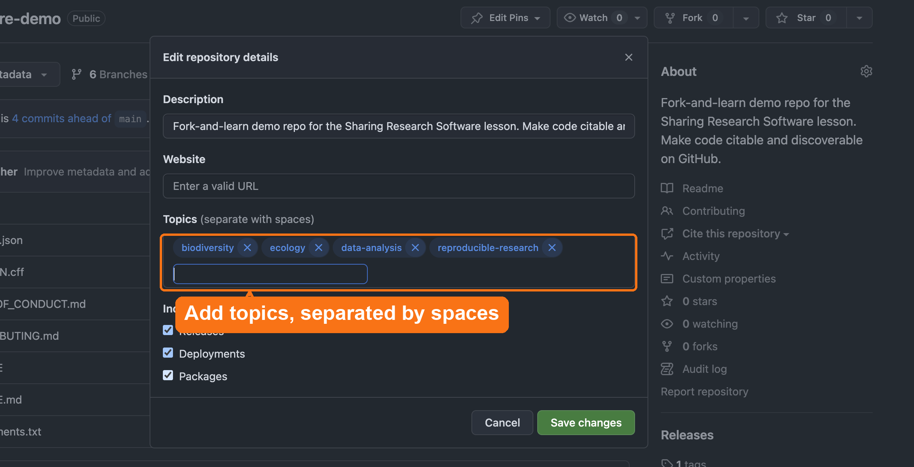

## Findability comes from description

A Zenodo record with a bare title and no keywords is a catalog record with no subject headings: retrievable if you already know it exists, invisible if you don't.

The tools are GitHub topics, Zenodo fields, and a README. The question is the same: *what would a seeker search for, and does this record contain it?*

You already have a license, a CITATION.cff, and a DOI. **This episode ties them together.**

::: {.notes}
Leigh normally teaches this episode; she's out today, so I'm covering it. Brief
acknowledgment, then move on.

This episode sits squarely in a library audience's expertise. Researchers treat metadata as a form to rush through; a scholcomm
professional treats it as the mechanism of discovery. The pitch to the researcher
is blunt: the work is finished, and five minutes of description determines whether
anyone ever finds it.
:::

## What counts as useful metadata?

Good metadata answers predictable questions with minimal effort from the reader:

- **What is this software?** A short description or abstract
- **Who made it?** Authors and ORCIDs
- **How do I cite it?** CITATION.cff and a DOI
- **What field is it for?** Keywords
- **What else does it relate to?** A related article, dataset, or funder

::: {.notes}
This is authority control: title, authors, and description should read the same in
the README, the CITATION.cff, and the Zenodo record, for the same reason a name
reads the same across catalog records. When they drift, indexes treat one piece of
software as several, and its citations scatter.
:::

## Add GitHub Topics

On your repo's front page, click the **gear icon next to About**, then fill in **Topics**:

- **Discipline:** `geospatial`, `text-mining`, `materials-science`
- **Method:** `simulation`, `visualization`, `machine-learning`
- **Language:** `python`, `r`

{fig-align="center" height="380"}

::: {.notes}
Live demo: open the software-demo repo, click the gear icon next to About, add
topics separated by spaces. Reuse the same topic words you'll put in CITATION.cff
and the Zenodo record later. Consistency is the point.
:::

## The 30-second rule

**Your README is your software's front door.**

If people can't tell what it does, how to install it, and how to use it in **30 seconds**, they leave.

A repo without a real README is a collection without a finding aid: only its author can use it.

## README: 7 essential sections

:::: {.columns}

::: {.column width="50%"}
1. **About:** what it does, in 2-3 sentences
2. **Features:** key capabilities
3. **Getting Started:** prerequisites and install
4. **Usage:** a minimal working example
:::

::: {.column width="50%"}
5. **Citation:** link to CITATION.cff or the DOI
6. **License:** state the terms
7. **Contact:** how to get help
:::

::::

::: {.small}
[UC OSPO README Guide](https://ucospo.net/oss-resources/template-guides/readme-guide/) *(UC-specific)*
:::

## Challenge: give your README the 7 sections

::: {.project-badge}
⏱ 5 min
:::

In your fork of `software-demo`:

1. Open `README.md` and click the **pencil icon** to edit
2. Add a `## ` heading for each of the 7 sections: About, Features, Getting Started, Usage, Citation, License, Contact
3. Fill in what you can, then **Commit changes** to `main`

Short on time? Copy the starter README from the Etherpad and replace `YOUR-USERNAME` and `YOUR-DOI`.

::: {.fragment}
Next: compare yours with the reference README.
:::

::: {.notes}
Paste the starter README (readme-starter.md in this folder) into the Etherpad
before this slide. Helpers: watch for people editing the upstream repo instead of
their fork, headings missing the space after ##, and anyone who forgets to commit.
The Preview tab in GitHub's editor shows the rendered headings. Their DOI is the
Sandbox DOI from Reid's episode. Then go to the before/after slide as the reveal.
:::

## Before → after

:::: {.columns}

::: {.column width="40%"}
**❌ Before** (`main`, starting state)

```markdown
# Biodiversity Analysis Toolkit

Analysis tools for biodiversity
research data.
```

One line of description. No install steps, no usage, no citation, no license, no one to contact.
:::

::: {.column width="60%"}
**✅ After** (`05-add-metadata`, abridged)

```markdown
# Biodiversity Analysis Toolkit
[DOI badge] [License badge]
Analysis tools for biodiversity...   <!-- 1 About -->

## Features                          <!-- 2 -->
- Citable, open source, documented

## Getting Started                   <!-- 3 -->
Prerequisites: Python 3.9+
### Installation & Usage             <!-- 4 -->
pip install -r requirements.txt
python src/analysis.py

## Citation                          <!-- 5 -->
Cite via CITATION.cff or the DOI badge.
## License                           <!-- 6 -->
BSD 3-Clause. See LICENSE.
## Contact                           <!-- 7 -->
Open an issue in this repository.
```
:::

::::

::: {.notes}
Every one of the 7 sections from the previous slide is here; the numbers in the
comments map back to that list. Usage is folded into Getting Started, which is
common and fine. The real README also has Contributing, Code of Conduct, and
Authors sections; open the 05-add-metadata branch to show the full thing.
This is the R in FAIR, in practice.
:::

## Beyond the README: community health files {background-color="#f0f4fa"}

:::: {.columns}

::: {.column width="33%"}
**CONTRIBUTING.md**\
How to contribute. Add one *if* you want contributions, or say plainly that you don't.
:::

::: {.column width="33%"}
**CODE_OF_CONDUCT.md**\
Behavioral standards. [Contributor Covenant][cc] is the standard choice.
:::

::: {.column width="33%"}
**CHANGELOG.md**\
Version history: what's new, what broke, what changed.
:::

::::

[cc]: https://www.contributor-covenant.org/

::: {.notes}
CONTRIBUTING.md isn't always needed. Plenty of solid research software has no
contributor pipeline, and an invitation you can't follow up on creates more work
than it saves. "I'm not looking for contributors right now,
please just open an issue" is a complete, honest CONTRIBUTING.md.
:::

## GitHub recognizes certain filenames

| File | What GitHub does |
|---|---|
| `README.md` | Renders as the repository's landing page |
| `LICENSE` | Shows the license in the repo sidebar |
| `CITATION.cff` | Adds "Cite this repository" with APA/BibTeX |
| `CODE_OF_CONDUCT.md` | Counts toward the community profile |
| `CONTRIBUTING.md` | Links guidelines when someone opens an issue/PR |
| `SECURITY.md` | Becomes the security policy |

::: {.small}
These only appear once the file is on the default branch. GitHub changes the details, so teach the pattern: the filename is the signal.
:::

## Where should software live? {background-color="#f0f4fa"}

**Zenodo is the recommended deposit location** for software:

- Archives each GitHub release automatically
- Mints a DOI for every version
- Registers records with DataCite, which discovery services harvest
- Free, run by CERN, recognized by journals and funders

Dataverse and Dryad are good for **datasets**, but don't auto-integrate with GitHub releases the same way.

::: {.small}
UC-specific: all UC campuses have Dryad. If you deposit data there, Dryad prompts a linked Zenodo code deposit automatically.
:::

## Zenodo metadata is what discovery systems see

Zenodo registers each record with **DataCite**. Search tools and discovery services pick it up from there, so the Zenodo record is what they show.

Add or refine: authors + ORCIDs, keywords, related works, funding, a readable description.

::: {.small}
**Caution:** if a repo has a `.zenodo.json`, Zenodo uses *that* file, not `CITATION.cff`. Keep them in sync or you'll publish two different citation records for the same software.
:::

## Supporting others: priority order when metadata is thin {background-color="#f0f4fa"}

1. A readable **description**, the biggest loss when it's missing
2. **Author ORCIDs**: without them, every J. Chen on Zenodo looks the same
3. **Keywords**, reused consistently across GitHub, CITATION.cff, Zenodo
4. **Related works**: link the software to its paper, dataset, and grant

::: {.notes}
Thin metadata means the software never surfaces in the catalog. The question
here is whether anyone can find it at all. Librarians in the room will often spot
the gaps faster than the researchers do.
:::

## Challenge: improve your Zenodo record

::: {.project-badge}
⏱ 5 min
:::

Open your record on **Zenodo Sandbox** (sandbox.zenodo.org) from the release episode. Select **Edit**, and add:

- keywords
- author ORCIDs
- a real description
- *optional:* a related paper or funder, if you have one

::: {.fragment}
Save and publish the updated record when done.
:::

## Challenge: which change makes it discoverable?

::: {.project-badge}
⏱ 3 min
:::

A tool has been public on GitHub for a year: one-line README, no topics, a Zenodo record with only a title. **Which single change matters most?**

A. Add collaborators\
B. Descriptive topics, matching keywords, and a description\
C. More frequent commits\
D. A shorter name

::: {.fragment}
**B.** People find software through its *description*. Commit activity doesn't help. It's the same reason a catalog record with no subject headings is nearly invisible.
:::

## Key points

- Description is what makes software findable, on GitHub, Zenodo, and beyond
- Keep it consistent across CITATION.cff, README, topics, and Zenodo: that's authority control

::: {.notes}
Remind the room the reference branches are there the whole time if anyone falls
behind, then close with how to get involved.
:::

## Get involved

:::: {.columns}

::: {.column width="50%"}
### Join

- **Slack:** day-to-day questions and resources
- **Newsletter:** sign up from the Contact page
- **Your campus mailing list:** also on the Contact page
:::

::: {.column width="50%"}
### Show up

- **All-campus virtual meetup:** first Thursday of each month, 10am
- **Coworking & office hours:** Tuesdays 10am, Thursdays 1pm
- **UCSB Open Source Lounge:** Thursdays 2:30-4:30pm, hybrid, open to all UC
:::

::::

**Start here:** ucospo.net/about/get-involved · Questions: Laura Langdon, Community Manager

::: {.small}
All times Pacific. Zoom links and calendar feeds: ucospo.net/events
:::

::: {.notes}
Paste the Get Involved link and the Slack invite into the Etherpad before this
slide. No minimum commitment: come to what's useful, when you can. Coworking is
the easiest on-ramp if someone wants help finishing what they started today.
Laura introduced the network at the start; this is the call to action. Hand off to wrap-up.
:::
