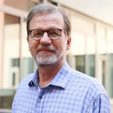

## Welcome: why time zones are an open source story

:::: {.columns}

::: {.column width="55%"}
Today: **Prof. Paul Eggert** (UCLA Computer Science) on the **Time Zone Database (tzdb)**.

* A small, volunteer-maintained project that quietly sits under operating systems, programming languages, phones, and the timestamps on our documents and photos
* When a government changes its clocks, someone has to notice, verify, and ship the fix
* Exactly the kind of **invisible infrastructure** an OSPO exists to support

**Format:** 30–40 min talk, then extended Q&A. Hybrid and recorded.
:::

::: {.column width="45%"}
::: {style="background:#f0f4fa; border-radius:8px; padding:1.2em 1.4em;"}
**UCLA Open Source Meetup**

Tuesday, Oct 6, 2026
12:00–1:00 pm

Charles E. Young Research Library, Room 11630L, and Zoom

Hosted by UCLA OSPO with the UC OSPO Network

[Event page and registration](https://calendar.library.ucla.edu/event/17080330)
:::
:::

::::

::: {.notes}
- Welcome; remind folks it's recorded, Q&A at the end
- Ask the room: who has ever hit a daylight-saving or time zone bug?
- Hook for the network: tzdb is the poster child for "critical infrastructure held up by very few maintainers"
:::

---

## UCLA is one of six campuses in the UC OSPO Network

:::: {.columns}

::: {.column width="55%"}
A **multi-campus collaboration** treating open source as shared infrastructure.

* **Six campuses:** Santa Cruz, Berkeley, Davis, Los Angeles, Santa Barbara, San Diego
* Launched April 2024, funded by the Alfred P. Sloan Foundation
* Led by UC Santa Cruz

**Three thematic areas**

* **Discovery**: who is building what across UC
* **Sustainability**: licensing, project health, community
* **Education**: shared training and learning pathways
:::

::: {.column width="45%"}
::: {style="background:#f0f4fa; border-radius:8px; padding:1.2em 1.4em;"}
**What UCLA does**

UCLA OSPO is based in the UCLA Library and co-leads the network's education work.

Today's meetup is one of the ways campuses bring open source people together locally. Other campuses run theirs too (next slide).
:::
:::

::::

::: {.notes}
- Keep this short; most of the room knows UCLA, fewer know the network
- Education theme: ucospo.net/education
:::

---

## Coming up across the network

| Date | Event | Where |
|:--|:--|:--|
| **Oct 6** | [**UCLA Open Source Meetup: Keeping the World on Time**](https://calendar.library.ucla.edu/event/17080330) (today) | UCLA, hybrid |
| Oct 8 | [How to Contribute to Open Source Software](https://www.eventbrite.com/e/2000937230119) | Eventbrite |
| **Oct 15** | [**UC Berkeley OSPO Monthly Meetup: Open Source AI Models**](https://events.berkeley.edu/BIDS/event/327522-ospo-monthly-meetup-open-source-ai-models) | Berkeley (BIDS), hybrid, 3–5:30 pm |
| Oct 22 | [CruzCon: Open Source for Research & Innovation](https://docs.google.com/forms/d/e/1FAIpQLSe9kqcmwp-OotTb9cUlhJ5CGttoGitT-aHg8JIqcKZC1-T0WQ/viewform) | UC Santa Cruz |
| Oct 23–24 | [Reboot the Earth Hackathon](https://events.library.ucdavis.edu/event/reboot-the-earth-hackathon-ucdavis) | UC Davis |
| Nov 5 | [All-Campus Virtual Meetup: Open Source and Tech Transfer](https://ucdavis.zoom.us/j/98527182449?pwd=PMdoVaOTSYuAHqPVWQbYPGHOmGrb5o.1) | Zoom |
| Nov 19 | [UC Berkeley OSPO Monthly Meetup (November)](https://events.berkeley.edu/BIDS/event/327532-ospo-monthly-meetup-november) | Berkeley (BIDS), 3–5:30 pm |

::: {.small}
Full calendar and registration links: [ucospo.net/events](https://ucospo.net/events/)
:::

::: {.notes}
- Berkeley's Oct 15 meetup on open source AI models is the natural follow-on if people liked today's infrastructure theme: who maintains the models, and under what licenses
- Weekly drop-ins: coworking Tuesdays 10am and Thursdays 1pm PT on Zoom; UCSB Open Source Lounge Thursdays 2:30–4:30
- Times/dates from ucospo.net/events as of Oct 6; Berkeley's own event page didn't load for me, so check details before announcing more than the date
:::

---

## Get connected

:::: {.columns}

::: {.column width="50%"}
**UCLA OSPO contacts**

* **Leigh Phan**, UCLA Library [leighphan@library.ucla.edu](mailto:leighphan@library.ucla.edu)
* **Tim Dennis**, UCLA Library [tdennis@library.ucla.edu](mailto:tdennis@library.ucla.edu)

**Bring us** a project, a licensing question, or a talk idea. We'd like to host more of these.
:::

::: {.column width="50%"}
**UC OSPO Network:** [ucospo.net](https://ucospo.net)

* Events calendar: [ucospo.net/events](https://ucospo.net/events/)
* Open coworking and office hours (Zoom): Tuesdays 10 am, Thursdays 1 pm PT
* UCSB Open Source Lounge: Thursdays 2:30–4:30 pm
* Mailing list and Slack: details on the site
:::

::::

:::: {.columns}

::: {.column width="50%"}
::: {style="display:flex; align-items:center; gap:1em;"}
{width="140px" fig-alt="QR code linking to these slides"}

**Scan for these slides**
:::
:::

::: {.column width="50%"}
::: {style="display:flex; align-items:center; gap:1em;"}
{width="140px" fig-alt="QR code linking to ucospo.net"}

**Scan for the UC OSPO Network**
:::
:::

::::

::: {.notes}
- Invite people to bring a project, a licensing question, or a talk idea
:::

---

## Today's speaker: Prof. Paul Eggert

:::: {.columns}

::: {.column width="30%"}
{width="100%"}
:::

::: {.column width="70%"}
Primary coordinator of the public-domain **Time Zone Database (TZDB)**, which coordinates timestamps on computing devices worldwide. A copy surely resides on your smartphone.

* Designed TZDB's naming standard; manages its data and code amid technical, legal, and political challenges
* Contributor to core free software: GCC, glibc, Coreutils, Diffutils, Gnulib, Emacs
* **2022 Free Software Foundation Award for the Advancement of Free Software**
* Career in industry, then joined UCLA Computer Science, where he is a Teaching Professor

**30–40 minute talk, then Q&A.**

::: {.small}
[IANA Time Zone Database](https://www.iana.org/time-zones) · [tz source on GitHub](https://github.com/eggert/tz)
:::
:::

::::

::: {.notes}
- Bio from the Oct 6 library event page draft (Eggert's own bio)
- Hand off: "Please join me in welcoming Prof. Eggert"
- Photo: UCLA CS faculty page
:::
