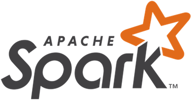
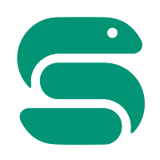
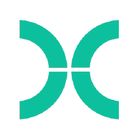
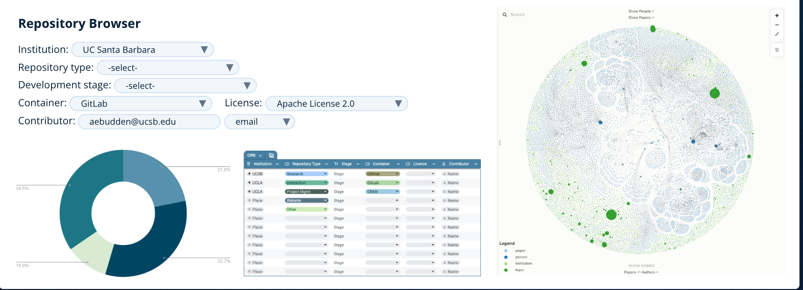
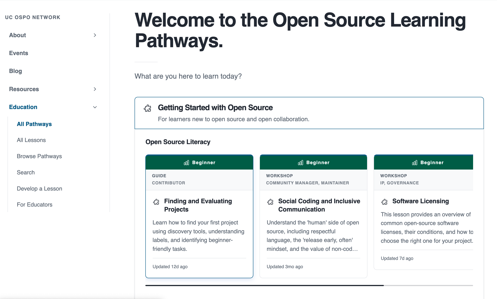
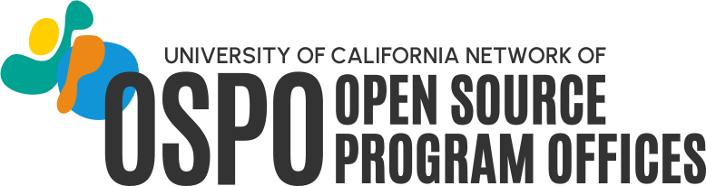

## The invisible layer

:::: {.columns}

::: {.column width="56%"}
Research data workflows run on open source:

* Data collection, cleaning, analysis, visualization
* Reproducibility tooling: containers, workflows, version control
* Repositories and scholarly infrastructure

**92%** of researchers use software; **67%** say their research would be impossible without it.

The people keeping it running are increasingly called **Research Software Engineers (RSEs)**, a growing professional community with no standard institutional home.

If every organization had to replace open source with proprietary equivalents, the cost would exceed **$8.8 trillion**.

::: {.small}
Hettrick et al. (<abbr title="Software Sustainability Institute">SSI</abbr>, 2014/2022) · Hoffmann, Nagle & Zhou (2024) doi:10.2139/ssrn.4693148
:::
:::

::: {.column width="44%"}
<div style="display:flex; flex-direction:column; align-items:center; gap:0.8em; padding-top:0.3em;">
<div class="logo-row" style="gap:1.1em; flex-wrap:wrap; justify-content:center;">
<div class="logo-item logo-item-sm"><span>Jupyter</span></div>
<div class="logo-item logo-item-sm"><span>Python</span></div>
<div class="logo-item logo-item-sm"><span>R</span></div>
<div class="logo-item logo-item-sm"><span>Git</span></div>
<div class="logo-item logo-item-sm"><span>Spark</span></div>
<div class="logo-item logo-item-sm"><span>Pandas</span></div>
<div class="logo-item logo-item-sm"><span>NumPy</span></div>
<div class="logo-item logo-item-sm"><span>Docker</span></div>
<div class="logo-item logo-item-sm"><span>Ray</span></div>
<div class="logo-item logo-item-sm"><span>ggplot2</span></div>
<div class="logo-item logo-item-sm"><span>dplyr</span></div>
<div class="logo-item logo-item-sm"><span>Snakemake</span></div>
<div class="logo-item logo-item-sm"><span>Nextflow</span></div>
</div>
</div>
:::

::::

::: {.notes}
- 92%/67% stats: set the stakes before the slide text does; audience already lives this
- RSE identity = researchers organizing around the support gap; US-RSE launched 2018, now thousands of members
- The gap: maintainer burns out → library abandoned; licensing question → publication blocked; nowhere to turn
- $8.8T breakdown: supply-side cost to recreate top 5,000 packages = $4.15B; demand-side if OSS disappeared = $8.8T (~2,000x ratio)
- Use that ratio with admins or funders who think this is a niche concern
:::

---

## We've been here before

People in this room helped build the open data movement:

* <abbr title="Findable, Accessible, Interoperable, Reusable">FAIR</abbr> principles: from aspiration to institutional expectation
* Data management plans embedded in grant workflows
* Curation, provenance, and stewardship as professional services
* Open science infrastructure: repositories, PIDs, metadata standards
* **<abbr title="FAIR Principles for Research Software">FAIR4RS</abbr>**: FAIR principles now extended to research software

**Software is the next frontier**, and UC has been showing the way for 50 years: <abbr title="Berkeley Software Distribution">BSD</abbr> Unix, Ceph, Apache Spark, <abbr title="Reduced Instruction Set Computer - V">RISC-V</abbr>, Ray. The pipeline from university research to global infrastructure is not rare or accidental.

> "The research done in academia was the seed. Foundations provided the soil. But the community was the sun."

::: {.small}
Barker et al. (2022) doi:10.1038/s41597-022-01710-x · Ruff, N. (2026) "The Role of Foundations in Advancing Open Collaboration and Innovation," UC Open Summit. youtu.be/eBriL3CDNeo
:::

::: {.notes}
- FAIR didn't happen by accident: data professionals insisted data deserved first-class treatment as a scholarly output
- FAIR4RS (Barker et al. 2022, RDA/FORCE11/ReSA) = same inflection point for software that FAIR was for data
- UC pipeline is the proof that research → global infrastructure is a pattern, not a fluke (BSD, Ceph, Spark, RISC-V, Ray all came out of UC)
- Ruff: "The students writing their class projects this very semester may be creating the next Ray" — not a metaphor, a track record
:::

---


## {background-color="#1f335e"}

::: {style="text-align: center; color: #ffffff; line-height: 1.8; margin-top: 0.8em;"}

**Summer 2000. UC Santa Cruz.**

PhD student Jim Kent assembled the human genome
on 50 borrowed PCs, icing his wrists to keep coding.

He finished **three days** before a corporate competitor's supercomputer.

**The genome stayed in the public domain.**

:::

::: {style="text-align: center; color: rgba(255,255,255,0.78); font-size: 0.52em; margin-top: 1.8em;"}
Kent, J.W. (2002). BLAT - The BLAST-Like Alignment Tool. *Genome Research* 12, 656–664. · genome.ucsc.edu
:::

::: {.notes}
- Take a beat. Let the room absorb it.
- Celera: $300M private funding, dedicated supercomputer cluster; Kent: 50 off-the-shelf PCs assembled in a hallway
- GigAssembler (~10,000 lines of C) in a few intense weeks, reportedly while icing his wrists to prevent carpal tunnel
- This is the open data argument — scientific outputs belong in the commons — applied to software and won by a grad student
- After the beat: "That is what UC research infrastructure looks like at the start."
:::

---

## What is an academic OSPO?

:::: {.columns}

::: {.column width="44%"}
An **Open Source Program Office** supports, governs, and promotes open source within an institution.

* Originated in industry: ~77% of large tech companies have one
* First academic OSPOs: Johns Hopkins, UC Santa Cruz, and RIT (2021)
* **34 academic OSPOs** in <abbr title="Community for University and Research Institution OSPOs">CURIOSS</abbr> worldwide and growing
* Core functions: policy, licensing guidance, best practices, education, community
:::

::: {.column width="56%"}

```{ojs}
//| echo: false
//| output: false
world_topo = fetch("https://cdn.jsdelivr.net/npm/world-atlas@2/countries-110m.json").then(r => r.json())
members = FileAttachment("curioss-members.csv").csv({typed: true})
```

```{ojs}
//| echo: false
Plot.plot({
  projection: {
    type: "equal-earth",
    domain: {
      type: "MultiPoint",
      coordinates: members.map(d => [+d.lon, +d.lat])
    },
    inset: 40
  },
  width: 660,
  height: 340,
  style: {background: "transparent"},
  marks: [
    Plot.graticule({stroke: "#e8eef8", strokeWidth: 0.5}),
    Plot.geo(topojson.feature(world_topo, world_topo.objects.land), {
      fill: "#e8eef8", stroke: "#ccc", strokeWidth: 0.5
    }),
    Plot.dot(members, {
      x: d => +d.lon,
      y: d => +d.lat,
      r: 7,
      fill: d => d.uc_network === "yes" ? "#ff9100" : "#003cb3",
      stroke: "white",
      strokeWidth: 1.2,
      tip: true,
      title: d => d.name
    })
  ]
})
```

[🟠 UC OSPO Network &nbsp;·&nbsp; 🔵 CURIOSS member]{.small}

::: {.sr-only}
World map showing 34 CURIOSS member institutions. Six UC campuses (orange) in California: Santa Cruz, Berkeley, Davis, Los Angeles, Santa Barbara, and San Diego. Twenty-eight additional institutions (blue) across the US, UK, Switzerland, Spain, Ireland, Luxembourg, and France.
:::

:::

::::

::: {.notes}
- Map is live and interactive — hover for institution names; UC = orange cluster on the west coast
- CNI late 2024: ~20 members; now 34, growing fast
- Academic model: less compliance, more enabling researchers and students already doing OSS work without any support structure
:::

---

## The UC OSPO Network

:::: {.columns}

::: {.column width="48%"}
A **multi-campus collaboration** treating open source as shared infrastructure.

* 6 campuses: Santa Cruz, Berkeley, Davis, Los Angeles, Santa Barbara, San Diego
* Launched April 2024, funded by the Alfred P. Sloan Foundation
* **$1.85M** in external funding to date
* Lead: UC Santa Cruz, the first OSPO in a large state university system
* Serves 280,000+ students and 25,000+ faculty

Acts as a **neutral convener**: no single campus, company, or grant cycle can pull the work away.

::: {.small}
Ruff (2026) UC Open Summit · youtu.be/eBriL3CDNeo
:::
:::

::: {.column width="52%"}

```{ojs}
//| echo: false
//| output: false
ca_states = fetch("https://cdn.jsdelivr.net/npm/us-atlas@3/states-10m.json").then(r => r.json())
uc_network_campuses = [
  {name: "UC Santa Cruz", short: "UCSC", lon: -122.0583, lat: 36.9741},
  {name: "UC Berkeley", short: "UCB", lon: -122.2595, lat: 37.8724},
  {name: "UC Davis", short: "UCD", lon: -121.7619, lat: 38.5382},
  {name: "UC Los Angeles", short: "UCLA", lon: -118.4452, lat: 34.0689},
  {name: "UC Santa Barbara", short: "UCSB", lon: -119.8489, lat: 34.4140},
  {name: "UC San Diego", short: "UCSD", lon: -117.2340, lat: 32.8801}
]
```

```{ojs}
//| echo: false
Plot.plot({
  projection: {
    type: "mercator",
    domain: {type: "MultiPoint", coordinates: [[-124.5, 32.4], [-114, 42.1]]}
  },
  width: 500,
  height: 420,
  style: {background: "transparent"},
  marks: [
    Plot.geo(
      topojson.feature(ca_states, ca_states.objects.states).features.find(d => +d.id === 6),
      {fill: "#e8eef8", stroke: "#b0bbcc", strokeWidth: 0.8}
    ),
    Plot.dot(uc_network_campuses, {
      x: d => d.lon,
      y: d => d.lat,
      r: 10,
      fill: "#ff9100",
      stroke: "white",
      strokeWidth: 1.8,
      tip: true,
      title: d => d.name
    }),
    Plot.text(uc_network_campuses, {
      x: d => d.lon,
      y: d => d.lat,
      text: d => d.short,
      dy: -18,
      fontSize: 13,
      fontWeight: "bold",
      fill: "#1f335e",
      stroke: "white",
      strokeWidth: 3
    })
  ]
})
```

::: {.sr-only}
Map of California showing six UC OSPO Network campuses: Santa Cruz, Berkeley, Davis, Los Angeles, Santa Barbara, and San Diego.
:::

:::

::::

::: {.notes}
- Six campuses span the length of the state
- UCSC head start: Ceph (Weil's 2004 dissertation) → Inktank → Red Hat → CROSS → first UC OSPO 2022 → Sloan funded the network
- Neutral convener framing (Ruff, UC Open 2026, 8:17–8:49): "code held in a neutral trust place — no single company can pull on it, no single country can claim it"; UC OSPO Network does this at system scale for policy and governance
:::

---

## Three thematic areas

:::: {.columns}

::: {.column width="33%"}
::: {style="background:#f0f4fa; border-radius:8px; padding:1.4em 1em; text-align:center; height:400px;"}
[🔭]{style="font-size:3em;"}

**Discovery**

Mapping who does what across the UC system: repos, contributors, tools, and practices
:::
:::

::: {.column width="33%"}
::: {style="background:#f0f4fa; border-radius:8px; padding:1.4em 1em; text-align:center; height:400px;"}
[🌱]{style="font-size:3em;"}

**Sustainability**

Keeping projects and communities healthy through licensing, project health, and community support
:::
:::

::: {.column width="33%"}
::: {style="background:#f0f4fa; border-radius:8px; padding:1.4em 1em; text-align:center; height:400px;"}
[📖]{style="font-size:3em;"}

**Education**

Coordinated training and learning pathways across campuses
:::
:::

::::

::: {.notes}
All network activity falls under these three. Governance maps to them: OSPO Leadership Group plus one working group per theme.
:::

---

## Discovery: knowing what's there

:::: {.columns}

::: {.column width="46%"}
**The 4 Ps framework**, applied at system scale:

* **People**: who contributes to OS software at UC?
* **Product**: what has been built?
* **Practice**: how do faculty and staff engage?
* **Perception**: what are contributors' experiences?

Tools: GitHub pipeline (200,000+ repos scanned; ~52,000 institutionally affiliated across 10 campuses), network-wide survey (294 respondents), UC Open Repository Browser (UC ORB)

::: {.small}
Gomez et al. (2025) arxiv:2506.18359 · Scarlett et al. (2025) doi:10.31235/osf.io/p8bx6_v1
:::
:::

::: {.column width="54%"}
{width="100%"}
:::

::::

::: {.notes}
- This is a methods story the audience recognizes: inventory, assess, make visible — what data librarians do
- Juanita Gomez led GitHub analysis and built UC ORB; full FOSSY talk: "Recipe for Discovery: Building the UC Open Source Repository Browser From Scratch"
- 200,000+ = full pipeline scan; 52,000 = repos with strong institutional affiliation after filtering
- Survey preprint data going to Dryad
:::

---

## Sustainability: keeping it running

:::: {.columns}

::: {.column width="58%"}

**58% of UC open source contributors are also maintainers.** Not users: stewards.

What they asked for most: sustainability grants, computing infrastructure, learning communities.

\#1 challenge: **finding time to write documentation.**

Nationally: **60%** of maintainers are unpaid; **43%** report burnout.

Network services:

* Cross-campus licensing working group (<abbr title="UC Office of the President">UCOP</abbr> + tech transfer + IT)
* Project health assessment (<abbr title="Open Source PRoject sustainabilitY tracker">OSSPREY</abbr>)
* Containerization support · Community management

::: {.small}
Scarlett et al. (2025) doi:10.31235/osf.io/p8bx6_v1 · Tidelift (2024) State of the Open Source Maintainer Report
:::

:::

::: {.column width="42%"}

<div style="display:flex; flex-direction:column; gap:0.8em; padding-top:0.2em;">

<div style="background:#1f335e; border-radius:8px; padding:1.1em 1em; color:white; text-align:center;">
<div style="font-size:2.6em; font-weight:700; color:#ff9100; line-height:1;">58%</div>
<div style="font-size:0.6em; margin-top:0.3em; line-height:1.4;">of UC <abbr title="Open Source Software">OSS</abbr> contributors<br>are also <strong>maintainers</strong><br><span style="opacity:0.7;">not just users, stewards</span></div>
</div>

<div style="background:#f0f4fa; border-radius:8px; padding:0.9em 1em; text-align:center;">
<div style="display:flex; justify-content:space-around; align-items:center;">
<div>
<div style="font-size:1.7em; font-weight:700; color:#1f335e; line-height:1;">60%</div>
<div style="font-size:0.5em; color:#555; margin-top:0.15em;">unpaid nationally</div>
</div>
<div style="width:1px; height:2em; background:#c6d2e8;"></div>
<div>
<div style="font-size:1.7em; font-weight:700; color:#1f335e; line-height:1;">43%</div>
<div style="font-size:0.5em; color:#555; margin-top:0.15em;">report burnout</div>
</div>
</div>
<div style="font-size:0.42em; color:#888; margin-top:0.5em;">Tidelift (2024) State of the Open Source Maintainer Report</div>
</div>

</div>

:::

::::

::: {.notes}
- 58% = the key reframe: not people who downloaded a package, but sustaining infrastructure others depend on — mostly without institutional recognition
- Licensing working group = clearest example of what only the network can do: UCOP + tech transfer (UCLA, UCB, UCSC) + IT; that table doesn't exist without a network-level convener
:::

---

## The dependency problem

{.r-stretch}

::: {.small}
xkcd #2347 (CC BY-NC 2.5) · UC survey: 58% of contributors are maintainers · Tidelift (2024): 60% unpaid, 43% burnt out
:::

::: {.notes}
- Let the comic breathe. The joke lands on its own.
- "A project some random person in Nebraska has been thanklessly maintaining since 2003" — that person is at every UC campus and most of your institutions too
:::

---

## AI and open source: a new pressure

AI code generation is changing what it means to maintain a project.

:::: {.columns}

::: {.column width="60%"}

* **Slop PRs**: AI-generated contributions that look complete but are off-spec, shallow, or carry subtle bugs
* Review burden grows while maintainer capacity stays flat
* The OSS projects that trained the models are now flooded by their output
* Security risk: AI-generated code in dependencies with undetected vulnerabilities

**OSPOs are developing responses:** contribution disclosure policies, AI-aware code review norms, project-level guidance.

::: {.small}
Baltes, Cheong & Treude (2026) arxiv:2603.27249 · GitClear (2024) "Coding on Copilot"
:::

:::

::: {.column width="40%"}

::: {style="background:#1f335e; border-radius:8px; padding:1.2em 1em; color:white; text-align:center; margin-top:0.5em;"}
**The structural shift**

**70%** of new AI PhDs go straight to industry

(a decade ago: 50/50)

**90%** of notable AI models come from a handful of companies

Academia is being sidelined from the systems it helped create.

::: {.small style="color:#aac4e8;"}
Ruff (2026) UC Open Summit · youtu.be/eBriL3CDNeo
:::
:::

:::

::::

::: {.notes}
- 70%/90% stats = direct quotes from Ruff keynote, UC Open 2026 (6:15–7:15)
- Baltes, Cheong & Treude (2026) arXiv:2603.27249: frames "slop PRs" as tragedy of the commons — individual productivity gains push costs onto maintainers
- Real examples: curl shut down its bug bounty in early 2026 (AI vulnerability reports turned 15-min verifications into days of work); Godot + RubyGems saw 10x spikes in low-quality AI contributions
- GitClear (2024): AI-assisted dev measurably increases code churn and reduces reuse — more review work on lower-quality patches
- Ruff on urgency: "The governance layer for AI is being written in 18–36 months. If you're not in the room, you'll inherit a system you have to live with."
:::

---

## Education: training as infrastructure

:::: {.columns}

::: {.column width="44%"}
Gap analysis → curriculum inventory → learning pathways

* Inventoried existing materials: Carpentries, CodeRefinery, The Turing Way, UC-specific content
* Organized by topic (licensing, sustainability, community) and by role (contributor, maintainer, manager)
* Published at [ucospo.net/education](https://ucospo.net/education)
* Coordinated with data literacy programs and Carpentries infrastructure
:::

::: {.column width="56%"}
{width="100%"}
:::

::::

::: {.notes}
- Most direct connection to this department's daily work
- Treat training the way data professionals treat data: find what exists, identify gaps, don't duplicate
- It's a living curriculum inventory, not a course catalog
:::

---

## Distributed expertise, system-wide capacity

Each campus brings what others don't. The network routes it to where it's needed.

:::: {.columns}

::: {.column width="48%"}
**Each campus contributes**

* Unique domain expertise and staff knowledge
* Local relationships with researchers and faculty
* Pilots that can only run with campus context
* Specialized capacity others can learn from
:::

::: {.column width="48%"}
**The network multiplies it**

* Expertise flows across all six campuses
* Shared staffing no single campus could fund
* Smaller campuses build capacity they couldn't alone
* A success at one becomes a template for five
:::

::::

Governed by an OSPO Leadership Group and thematic working groups, one per campus, coordinated at system level.

::: {.notes}
- Each campus is a node that both contributes and draws from the network (not competing priorities)
- Campus specializations: Davis → software sustainability research; UCLA → library integration + data services; UCSD → educational outreach; UCSC → deepest OSS governance history (CROSS)
- Governance: OSPO Leadership Group (one rep per campus) sets direction; three thematic working groups do the work; GitHub-based project management keeps it open and legible
- Key point for this audience: a librarian at a smaller campus now has access to expertise from six campuses — that's what the network actually delivers
:::

---


## Our seat is scholarly communication

We already promote best practices across the research lifecycle.
Software is the same work in a new medium.

| What we do for scholarship | The software version |
|---|---|
| Citation and attribution  | software citation, CITATION.cff |
| Persistent identifiers    | Zenodo DOIs for releases |
| Metadata and discovery    | repository metadata, FAIR4RS |
| Licensing and rights      | open source license guidance |
| Preservation              | versioned, archived releases |

Not a new mission. The same one, pointed at code.

::: {.notes}
- The thesis: the library's seat at the OSPO table is scholarly communication
- Every row is something we already do for data and publications; software is the next medium
- Frame for the room: not starting something new, extending what we are good at
:::

---

## Where this meets your work

For data professionals, the OSPO sits at the intersection of:

* Research software engineering ↔ data management
* Licensing compliance ↔ open data policy
* Reproducibility tooling ↔ FAIR / FAIR4RS
* Training infrastructure ↔ data literacy programs
* RSE community ↔ library research support

**For your institution:**

* Where does open source software governance currently live?
* What would it take to treat it as infrastructure rather than a side project?

::: {.notes}
- This is the invitation: library staff should be at the OSPO table. You work across the research lifecycle, understand data governance, run training programs
- RSEs are natural collaborators, many already embedded in or adjacent to library services
- Question for the room: does your institution have an RSE group, research computing team, or data science center? That's where this conversation belongs.
:::

---

## You're already doing this work

:::: {.columns}

::: {.column width="52%"}
If you do technical data services, researchers are already bringing you these questions:

* "What license should I use for this code?"
* "Is this library still maintained? Should I depend on it?"
* "How do I make this reproducible and citable?"
* "My funder wants a software management plan."
* "How do I accept contributions from collaborators?"

**That is OSPO work.** The frame makes it legible to you, your institution, and the researchers you serve.
:::

::: {.column width="48%"}

::: {style="background:#1f335e; border-radius:8px; padding:0.85em 0.9em; color:white; margin-bottom:0.5em;"}
**Raise the floor, not just solve the ticket**

Fixing their immediate problem gets them through the week.

Moving them from "it runs on my machine" to maintainable, licensed, citable software gets their whole lab there, and their students after them.

You don't need a formal OSPO to do this. You need the frame.
:::

::: {style="background:#f0f4fa; border-radius:8px; padding:0.65em 0.9em; font-size:0.72em;"}
**OSPO heuristics already in your toolkit:**
health signals · bus factor · governance files · FAIR4RS · software <abbr title="Data Management Plans">DMPs</abbr> · contributor conventions · community governance
:::

:::

::::

::: {.notes}
- Core distinction: reactive (fixes the week) vs. capacity-building (shifts lab practice that compounds across students and grants)
- Not about turning every data librarian into an OSPO director — about shifting what a researcher walks away knowing
- Health signals (bus factor, issue velocity, contributor diversity) = will this project be there next year?
- Governance files (README, CONTRIBUTING, CODE_OF_CONDUCT) = data README equivalent; make the project legible to the next person
- FAIR4RS + software DMPs = policy anchors that give researchers a reason to care now
- You don't need institutional approval: use the vocabulary and resources from ucospo.net in consultations today — you're already in the room where these questions get raised
- Carpentries angle: adding a session on software health, licensing, and CITATION.cff is low lift for every researcher in that room
:::

---

## Where it fits: instruction and outreach

Two tracks, both already in our wheelhouse.

**Informational (the why)**

* Why cite software, how to choose a license, planning for sustainability
* Workshops, consultations, guides, outreach

**Technical practice (the how)**

* README, LICENSE, CITATION.cff, a versioned release, a DOI
* Hands-on: the UC OSPO citable-software lesson

We don't have to build an OSPO to take a seat. We teach the practices.

::: {.notes}
- The department already runs instruction and outreach: new content in an existing channel, not a new program
- Informational vs technical practice: some researchers need the why, some are ready for the how
- The next slide lists the ready-made resources and the lesson
:::

---

## What you can do right now

If you advise on data-intensive research, you are probably already helping with code.

**The network has already built the resources** (Laura Langdon, UC OSPO)**:**

* [`README.md`](https://ucospo.net/oss-resources/template-guides/readme-guide/) - template + guide
* [`LICENSE`](https://ucospo.net/oss-resources/template-guides/license-guide/) - guide includes UC-approved options
* [`CONTRIBUTING.md`](https://ucospo.net/oss-resources/template-guides/contributing-guide/) - template + guide
* [`CODE_OF_CONDUCT.md`](https://ucospo.net/oss-resources/template-guides/code-of-conduct-guide/) - Contributor Covenant + guidance
* `CITATION.cff` + Zenodo release → citable, versioned <abbr title="Digital Object Identifier">DOI</abbr>

**Going further:**

* [Growing a Community Around a Project](https://ucospo.net/oss-resources/growing-community/) - UC OSPO
* [Sharing Research Software: Reproducible, Citable, and Discoverable](https://ucospo.net/research-software-citable-discoverable/) - Carpentries Incubator lesson (covers `pixi`, CITATION.cff, Zenodo, discoverability)

::: {.notes}
- Don't build these yourself: Laura Langdon published templates + guides for all four key files in September 2025 — on ucospo.net now
- Carpentries lesson (mine, pre-alpha but usable): full workflow from licensing through environment management to minting a DOI on Zenodo
- A researcher who already deposits data with your help is one conversation away from a fully citable software package
- You need the consultation habit and a link to these resources. That's it.
:::

---

## Learn more / connect

:::: {.columns}

::: {.column width="68%"}
**UC OSPO Network:** [ucospo.net](https://ucospo.net)

* Education site: [ucospo.net/education](https://ucospo.net/education)
* Mailing list, Slack, events calendar

**Global network:** [curioss.org](https://curioss.org), 34 academic OSPOs worldwide and growing

**Tim Dennis**
Director, Data Science Center, UCLA Library
tdennis@library.ucla.edu

::: {.small style="margin-top:0.7em; padding:0.5em 0.8em; background:#f0f4fa; border-radius:6px; border-left:3px solid #ff9100;"}
🖥 Slides: **[link TBD]**
:::
:::

::: {.column width="32%"}
<div style="display:flex; flex-direction:column; align-items:center; justify-content:center; gap:0.5em; height:100%">
{width="220px"}

::: {.small style="text-align:center; color:#555;"}
ucospo.net
:::
</div>
:::

::::


::: {.notes}
- UC ORB: good follow-up for anyone who wants to see the discovery tooling
- CURIOSS community: good follow-up for anyone whose institution is thinking about starting an OSPO
- Leave time for questions — AI and sustainability slides tend to generate them
:::
